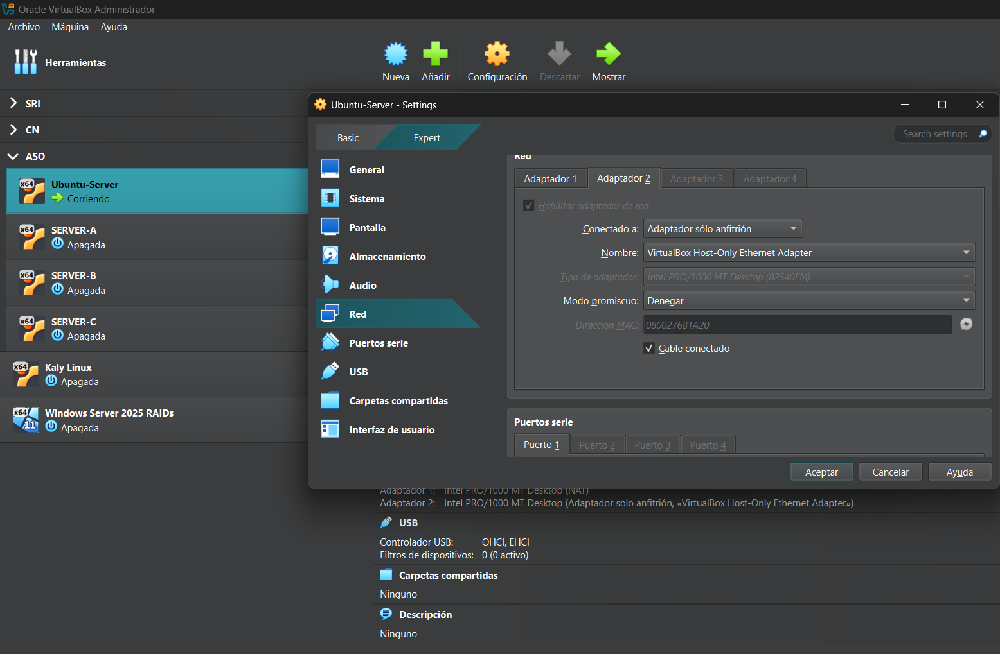
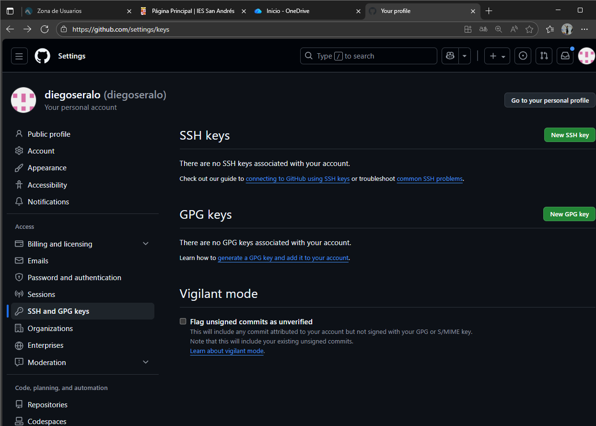
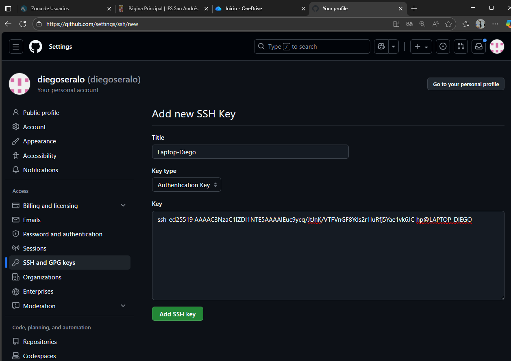

# PR0202: Conexión remota con SSH

## 1. Preparación de la máquina y configuración de la red

1. Desde la interfaz de VirtualBox añade un segundo adaptador de red en modo *red solo anfitrión*. 
---


---
2. Indica la dirección IP que asigna VirtualBox a este adaptador de red, así como la dirección IP del adaptador correspondiente en la máquina anfitrión.
---
En Ubuntu Server haces `ip a`;
```sql
1: lo: <LOOPBACK,UP,LOWER_UP> mtu 65536 qdisc noqueue state UNKNOWN group default qlen 1000
    link/loopback 00:00:00:00:00:00 brd 00:00:00:00:00:00
    inet 127.0.0.1/8 scope host lo
       valid_lft forever preferred_lft forever
    inet6 ::1/128 scope host noprefixroute
       valid_lft forever preferred_lft forever
2: enp0s3: <BROADCAST,MULTICAST,UP,LOWER_UP> mtu 1500 qdisc fq_codel state UP group default qlen 1000
    link/ether 08:00:27:a4:53:bb brd ff:ff:ff:ff:ff:ff
    inet 10.0.2.15/24 metric 100 brd 10.0.2.255 scope global dynamic enp0s3
       valid_lft 84855sec preferred_lft 84855sec
    inet6 fd00::a00:27ff:fea4:53bb/64 scope global dynamic mngtmpaddr noprefixroute
       valid_lft 86075sec preferred_lft 14075sec
    inet6 fe80::a00:27ff:fea4:53bb/64 scope link
       valid_lft forever preferred_lft forever
3: enp0s8: <BROADCAST,MULTICAST,UP,LOWER_UP> mtu 1500 qdisc fq_codel state UP group default qlen 1000
    link/ether 08:00:27:68:1a:20 brd ff:ff:ff:ff:ff:ff
    inet 192.168.56.100/24 brd 192.168.56.255 scope global enp0s8
       valid_lft forever preferred_lft forever
    inet6 fe80::a00:27ff:fe68:1a20/64 scope link
       valid_lft forever preferred_lft forever
```
Y en la maquina anfitriona `ipconfig`
```yaml
Configuración IP de Windows


Adaptador de Ethernet vEthernet (Default Switch):

   Sufijo DNS específico para la conexión. . :
   Vínculo: dirección IPv6 local. . . : fe80::6018:1e58:56de:d1d7%40
   Dirección IPv4. . . . . . . . . . . . . . : 172.24.16.1
   Máscara de subred . . . . . . . . . . . . : 255.255.240.0
   Puerta de enlace predeterminada . . . . . :

Adaptador de Ethernet Ethernet 3:

   Sufijo DNS específico para la conexión. . :
   Vínculo: dirección IPv6 local. . . : fe80::b30b:24ce:495f:7bec%13
   Dirección IPv4. . . . . . . . . . . . . . : 192.168.56.106
   Máscara de subred . . . . . . . . . . . . : 255.255.255.0
   Puerta de enlace predeterminada . . . . . :

Adaptador de LAN inalámbrica Conexión de área local* 1:

   Estado de los medios. . . . . . . . . . . : medios desconectados
   Sufijo DNS específico para la conexión. . :

Adaptador de LAN inalámbrica Conexión de área local* 2:

   Estado de los medios. . . . . . . . . . . : medios desconectados
   Sufijo DNS específico para la conexión. . :

Adaptador de LAN inalámbrica Wi-Fi:

   Sufijo DNS específico para la conexión. . : home
   Vínculo: dirección IPv6 local. . . : fe80::6eed:d87e:267e:60df%4
   Dirección IPv4. . . . . . . . . . . . . . : 192.168.1.17
   Máscara de subred . . . . . . . . . . . . : 255.255.255.0
   Puerta de enlace predeterminada . . . . . : 192.168.1.1
```
--- 
3. Comprueba que hay conectividad entre el anfitrión y la máquina virtual.
---
En la maquina anfitriona:
```shell
ping 192.168.56.100
```
En Ubuntu Server:
```bash
ping 192.168.56.106
```
Si ambas hacen ping hay conectividad.

--- 
4. Cambia el *hostname* de Ubuntu para que se llame `{iniciales}_server`. 
---
```bash 
sudo hostnamectl set-hostname dsa_server
```
---
5. Realiza los cambios necesarios en tu equipo Windows para que te resuelva localmente el nombre del servidor Ubuntu (si tienes dudas, en los recursos tienes una breve explicación de cómo hacerlo)
---
Abres el bloc de notas como administrador y abres el archivo  `C:\Windows\System32\drivers\etc\hosts`:
Y añades:
```
192.168.56.100  dsa_server
```
---
## 2. Creación del usuario y conexión SSH

1. Crea en Ubuntu un usuario que se llamará `{iniciales}_ssh`, donde iniciales son las de tu nombre y apellidos.
---
```bash
sudo adduser dsa_server
```
---
2. Realiza los pasos necesarios para que este usurio se pueda conectar mediante SSH mediante contraseña.
---
En Ubuntu Server:
```bash
sudo apt update
sudo apt install openssh-server -y
sudo systemctl enable ssh
sudo systemctl start ssh
```
En la maquina anfitriona
```shell
ssh dsa_server@192.168.56.100
```
Introduces la contraseña del usuario `dsa_server` y estas conectado.

---
3. Una vez que hayas verificado que la conexión funciona haz los cambios necesarios para que la conexión se realize mediante un par de claves pública-privada de forma transparente para el usuario.
---
En la maquina anfitriona :
```shell 
ssh-keygen
```
Ahora las exportamos al usuario `dsa_server` del Ubuntu Server:
```shell
scp .\.ssh\id_ed25519.pub dsa_server@192.168.56.100:~
```
Hacemos ssh:
```shell
ssh dsa_server@192.168.56.100
```
Y desde el `dsa_server` creamos la carpeta `.ssh` e introducimos la clave en las claves autorizadas:
```bash
mkdir .ssh
cat id_ed25519.pub >> .ssh/authorized_keys
```
Y y podriamos conectarnos de forma transparente.

---
## 3. Conexión transparente a Github

Ahora que ya estás cómodo con la autenticación mediante par de claves pública-privada, intenta configurar tu Github para que te puedas conectar sin necesidad de introducir tu contraseña. Como pista, tienes que acceder a *tu perfil -> Settings -> SSH and GPG keys*

---
En PowerShell:
```shell
type $env:USERPROFILE\.ssh\id_ed25519.pub
```
Copias lo que te salga.
Después, vas a GitHub -> Configuración -> SSH and GPG keys y le das a `New SSH key`:

Introduces un nombre y donde `key` lo que copiaste antes:

Luego desde PowerShell:
```shell
ssh git@github.com
```
---
[VOLVER A INICIO](../../../index.md)