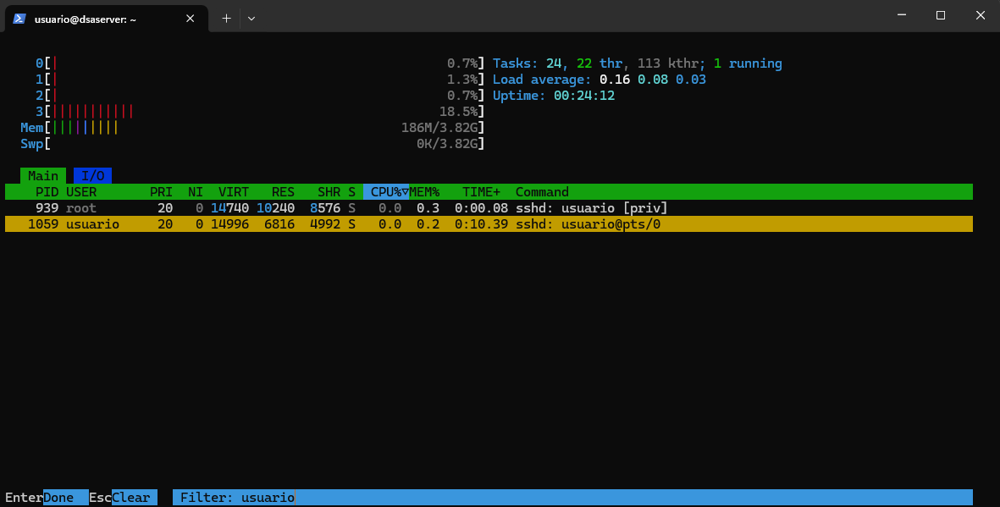

# PR0204: Gestión de procesos en Linux 

## **Introducción:**  

El objetivo de esta práctica es familiarizarte con el manejo de procesos en un sistema Linux, utilizando diversas herramientas y comandos para monitorizar, gestionar y manipular procesos.

## **Pasos a seguir:**

1. **Exploración básica de procesos:**
   - Abre una terminal y utiliza el comando `ps` para listar los procesos asociados a tu usuario. Anota el PID (Process ID) de al menos tres procesos.
  
    ---
    ```bash
    usuario@dsaserver:~$ ps
      PID TTY          TIME CMD
    1159 pts/0    00:00:00 bash
    1170 pts/0    00:00:00 ps
    ```
    ---
   - Usa el comando `ps aux` para listar todos los procesos del sistema. Identifica y anota el PID de un proceso que no pertenezca a tu usuario.
  
    ---
    ```bash
    usuario@dsaserver:~$ ps aux
    message+     752  0.1  0.1   9784  5376 ?        Ss   16:39   0:00 @dbus-daemon --system --address=sys
    polkitd      759  0.1  0.2 383704  9372 ?        Ssl  16:39   0:00 /usr/lib/polkit-1/polkitd --no-debu
    root         769  0.0  0.0      0     0 ?        I<   16:39   0:00 [kworker/R-cfg80]
    ``` 
    ---
   - Responde a las siguientes **preguntas**:
     - ¿Qué diferencia hay entre el comando `ps` y `ps aux`?
      ---

      `ps`: muestro los procesos del terminal actual.
      `ps aux`: muestra todos los procesos del sistema. 
  
      ---
     - Cuando decimos que un proceso pertenece a un usuario, ¿qué implicaciones tiene? Es decir, ¿en qué afecta eso al proceso?
  
      ---
      Siginifica que solo ese usuario (o root) puede modificar, cambiar o finalizar ese proceso.

      ---
2. **Monitorización de procesos en tiempo real:**
   - Utiliza el comando `top` para monitorizar los procesos en tiempo real. Identifica el proceso que consume más CPU y anota su PID.
  
    ---
    ```bash
    usuario@dsaserver:~$ top
        PID USER      PR  NI    VIRT    RES    SHR S  %CPU  %MEM     TIME+ COMMAND
        407 root      20   0       0      0      0 I   0,7   0,0   0:01.44 kworker/0:3-events
    ```
    ---
   - Cambia la visualización de `top` para ordenar los procesos por uso de memoria (tecla `M`). Anota el nombre del proceso que consume más memoria.
  
    ---
    ```bash
        PID USER      PR  NI    VIRT    RES    SHR S  %CPU  %MEM     TIME+ COMMAND
        1158 usuario   20   0   14992   7072   5120 S   2,9   0,2   0:01.86 sshd
   ```
   ---
   - Responde a las siguientes **preguntas**:
     - ¿Qué columnas de información se muestran en `top` y cuál es su significado?
  
      ---
      `PID`: Identificador del proceso.
      `USER`: Propietario.
      `PR`: Prioridad del proceso
      `NI`: Indica si el proceso tiene prioridad alta o baja.
      `VIRT`: Cantidad total de memoria virtual usada por el proceso
      `RES`: Memoria física residente en uso real
      `SHR`: Cantidad de memoria compartida con otros procesos.
      `S`: Estado del proceso:
      `%CPU`: Porcentaje de uso de CPU por el proceso.
      `%MEM`: Porcentaje de uso de memoria RAM.
      `TIME+`: Tiempo total de CPU consumido por el proceso desde que inició.
      `COMMAND`: Nombre o comando que generó el proceso.

      ---
     - ¿Cómo puedes cambiar el intervalo de actualización de `top`?
  
      ---
      Presionas la tecla `d` y escribes el número de segundos.

      ---

3. **Detener y reanudar procesos:**
   - Ejecuta el comando `sleep 300 &` para crear un proceso en segundo plano que duerma durante 300 segundos.
  
    ---
    ```bash
      usuario@dsaserver:~$ sleep 400 &
      [1] 1107
    ```
    ---
   - Usa el comando `jobs` para listar los trabajos en segundo plano. Anota el ID del trabajo.
  
    ---
    ```bash
    usuario@dsaserver:~$ jobs
    [1]+  Running                 sleep 400 &
    ```
    ---
   - Detén el proceso usando el comando `kill` con la señal `SIGSTOP`. Verifica que el proceso esté detenido.
  
    ---
    ```bash
    usuario@dsaserver:~$ kill -SIGSTOP 1107
    usuario@dsaserver:~$ ps -l
    F S   UID     PID    PPID  C PRI  NI ADDR SZ WCHAN  TTY          TIME CMD
    0 S  1000    1062    1059  0  80   0 -  2162 do_wai pts/0    00:00:00 bash
    0 T  1000    1107    1062  0  80   0 -  1421 do_sig pts/0    00:00:00 sleep
    0 R  1000    1108    1062 83  80   0 -  2729 -      pts/0    00:00:00 ps

    [1]+  Stopped                 sleep 400
    ```
    ---
   - Reanuda el proceso usando el comando `kill` con la señal `SIGCONT`. Verifica que el proceso esté en ejecución nuevamente.
  
    ---
    ```bash
    usuario@dsaserver:~$ kill -SIGCONT 1107
    usuario@dsaserver:~$ ps -l
    F S   UID     PID    PPID  C PRI  NI ADDR SZ WCHAN  TTY          TIME CMD
    0 S  1000    1062    1059  0  80   0 -  2162 do_wai pts/0    00:00:00 bash
    0 S  1000    1107    1062  0  80   0 -  1421 do_sys pts/0    00:00:00 sleep
    0 R  1000    1113    1062 99  80   0 -  2729 -      pts/0    00:00:00 ps
    ```
    ---
   - Responde a las siguientes **preguntas**:
     - ¿Qué efecto tiene la señal `SIGSTOP` sobre un proceso?
  
      ---
      Suspende el proceso sin finalizarlo.

      ---
     - ¿Cómo puedo verificar si un proceso está detenido o en ejecución?
  
      ---
      Usando `ps -l` o `top`

      ---

4. **Terminar procesos:**
   - Crea un proceso en segundo plano con el comando `sleep 600 &`.
  
    ---
    ```bash
    usuario@dsaserver:~$ sleep 600 &
    [2] 1122
    ```
    ---
   - Usa el comando `ps` para encontrar el PID del proceso `sleep`.
  
    ---
    ```bash
    usuario@dsaserver:~$ ps
    PID TTY          TIME CMD
    1062 pts/0    00:00:00 bash
    1122 pts/0    00:00:00 sleep
    1124 pts/0    00:00:00 ps
    ```
    ---
   - Termina el proceso usando el comando `kill` con la señal `SIGTERM`. Verifica que el proceso haya sido eliminado.
  
    ---
    ```bash
    usuario@dsaserver:~$ kill -SIGTERM 1122
    usuario@dsaserver:~$ ps
    PID TTY          TIME CMD
    1062 pts/0    00:00:00 bash
    1125 pts/0    00:00:00 ps
    [2]+  Terminated              sleep 600
    ```
    ---
   - Responde a las siguientes **preguntas**:
     - ¿Qué diferencia hay entre las señales `SIGTERM` y `SIGKILL`?
  
      ---
      `SIGTERM`: termina el proceso permitiendo guardar datos.
      `SIGKILL`: Fuerza terminar el proceso.

      ---
     - ¿Por qué es preferible utilizar `SIGTERM` antes que `SIGKILL` para terminar un proceso?
  
      ---
      Porque evita la perdida de datos.

      ---

5. **Prioridades de procesos:**
   - Ejecuta el comando `nice -n 10 sleep 300 &` para crear un proceso con una prioridad baja.
  
    ---
    ```bash
    usuario@dsaserver:~$ nice -n 10 sleep 300 &
    [1] 1135
    ```
    ---
   - Usa el comando `ps -l` para ver la prioridad (NI) del proceso. Anota el valor de NI.
  
    ---
    ```bash
    usuario@dsaserver:~$ ps -l
    F S   UID     PID    PPID  C PRI  NI ADDR SZ WCHAN  TTY          TIME CMD
    0 S  1000    1062    1059  0  80   0 -  2227 do_wai pts/0    00:00:00 bash
    0 S  1000    1135    1062  0  90  10 -  1421 hrtime pts/0    00:00:00 sleep
    0 R  1000    1139    1062 99  80   0 -  2729 -      pts/0    00:00:00 ps
    ```
    ---
   - Cambia la prioridad del proceso usando el comando `renice`. Establece la prioridad a 5 y verifica el cambio con `ps -l`.
  
    ---
    ```bash
    usuario@dsaserver:~$ sudo renice 5 -p 1135
    [sudo] password for usuario:
    1135 (process ID) old priority 10, new priority 5
    ```
    ---
   - Responde a las siguientes **preguntas**:
     - ¿Para qué sirve el comando `nice`?
  
      ---
      Para inicia un proceso con una prioridad especifica.

      ---
     - ¿Qué rango de valores puede tomar la prioridad (nice value) de un proceso y qué significa cada extremo?
  
      ---
      De `-20`, mayor prioridad, a `19`, menor prioridad.

      ---
     - ¿Qué ocurre si intentas cambiar la prioridad de un proceso que no te pertenece?
  
      ---
      Solo te dejaría si fueses `root`.

      ---

6. **Procesos en primer y segundo plano:**
   - Ejecuta el comando `sleep 200` en primer plano. Detén el proceso usando `Ctrl+Z`.
  
    ---
    ```bash
    usuario@dsaserver:~$ sleep 200
    ^Z
    [1]+  Stopped                 sleep 200
    ```
    ---
   - Usa el comando `bg` para mover el proceso detenido a segundo plano.
  
    ---
    ```bash
    usuario@dsaserver:~$ bg
    [1]+ sleep 200 &
    ```
    ---
   - Trae el proceso de segundo plano a primer plano usando el comando `fg`.
  
    ---
    ```bash
    usuario@dsaserver:~$ fg
    sleep 200
    ```
    ---
   - Responde las siguientes **preguntas**:
     - ¿Qué significa que un proceso está en segundo plano?
  
      ---
      Que sigue funcionando, sin bloquear el terminal.

      ---
     - ¿Qué comando utilizarías para mover un proceso detenido a segundo plano?
  
      ---
      ```bash
      bg
      ```
      ---
     - ¿Cómo puedes traer un proceso de segundo plano a primer plano si tienes múltiples trabajos en segundo plano?
  
      ---
      ```bash
      fg %n
      ```
      Donde `n`es el número que muestra el comando `jobs`.

      ---

7. **Uso de `pstree` y `htop`:**
   - Instala la herramienta `htop` si no está disponible en tu sistema (`sudo apt install htop`).
  
    ---
    ```bash
    usuario@dsaserver:~$ sudo apt install htop
    ```
    ---
   - Usa `htop` para explorar los procesos de manera interactiva. Filtra los procesos por usuario y anota el nombre de un proceso que pertenezca a otro usuario.
  
    ---
    ```bash
    usuario@dsaserver:~$ htop
    ```
    Dentro de htop, presionas `F4` e introduces el nombre de usuario.
    

    ---
   - Usa el comando `pstree` para visualizar los procesos en forma de árbol. Identifica un proceso padre y sus procesos hijos, y anota sus nombres.
  
    ---
    ```bash
    usuario@dsaserver:~$ pstree
    systemd─┬─ModemManager───3*[{ModemManager}]
            ├─agetty
            ├─cron
            ├─dbus-daemon
            ├─multipathd───6*[{multipathd}]
            ├─polkitd───3*[{polkitd}]
            ├─rsyslogd───3*[{rsyslogd}]
            ├─sshd───sshd───sshd───bash─┬─pstree
            │                           └─sleep
            ├─systemd───(sd-pam)
            ├─systemd-journal
            ├─systemd-logind
            ├─systemd-network
            ├─systemd-resolve
            ├─systemd-timesyn───{systemd-timesyn}
            ├─systemd-udevd
            ├─udisksd───5*[{udisksd}]
            └─unattended-upgr───{unattended-upgr}
    ```
    El proceso padre es `systemd` y sus hijos lo de la rama conectada a el.

    ---
   - Responde las siguientes **preguntas**:
     - ¿Qué ventaja tiene utilizar `pstree` frente a `ps` para visualizar procesos?
  
      ---
      Ver la jerarquía de procesos para entender depencencias.

      ---
     - ¿Cómo puedes filtrar procesos por usuario en `htop`?
  
      ---
      Presionando `F4` e introduciendo el nombre de usuario.

      ---

8. **Matar procesos de manera forzosa:**
   - Crea un proceso en segundo plano con `sleep 400 &`.
  
    ---
    ```bash
    usuario@dsaserver:~$ sleep 400 &
    [2] 1213
    ```
    ---
   - Usa el comando `kill -9` para terminar el proceso de manera forzosa. Verifica que el proceso haya sido eliminado.
  
    ---
    ```bash
    usuario@dsaserver:~$ kill -9 1213
    usuario@dsaserver:~$ ps
    PID TTY          TIME CMD
    1062 pts/0    00:00:00 bash
    1152 pts/0    00:00:00 sleep
    1214 pts/0    00:00:00 ps
    [2]-  Killed                  sleep 400
    ```
    ---
   - Responde las siguientes **preguntas**:
     - ¿En qué casos sería necesario usar `kill -9` en lugar de `kill` sin opciones?
  
      ---
      Cuando un proceso esta colgado.

      ---
     - ¿Qué riesgos implica usar `SIGKILL` para terminar un proceso?
  
      ---
      Perdida de datos, corrupción de archivos o dejar recursos bloqueados.
      
      ---
[VOLVER A INICIO](../../../index.md)