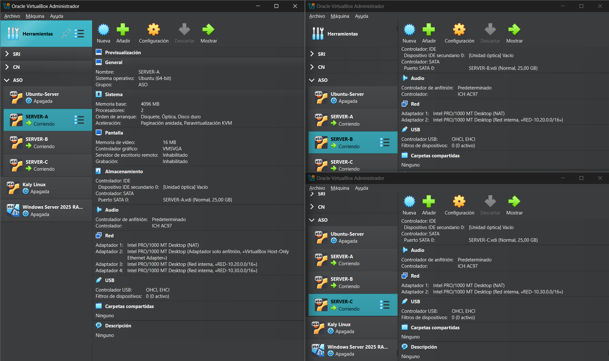
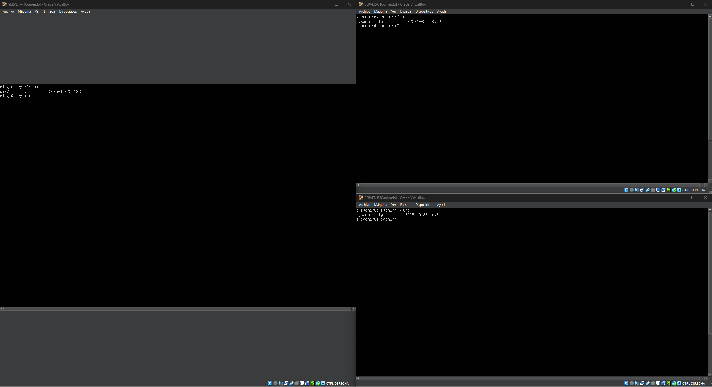

# PR02R1: Conexión remota con SSH entre redes

## Entorno de trabajo

En esta práctica tienes que preparar un entorno con las siguientes características:

- Necesitas 3 máquinas virtuales cuyo nombres de equipo serán: `SERVER-A`, `SERVER-B` y `SERVER-C`
- Tendrás una red solo-anfitrión que se conectará a `SERVER-A`
- También necesitarás dos redes internas: `10.20.0.0/16` y `10.30.0.0/16`
- Las máquinas `SERVER-A` y `SERVER-B` estarán conectadas a la primera red, mientras que `SERVER-B` (que tendrá 2 adaptadores de red) y `SERVER-C` estarán conectadas a la segunda red.

- El equipo `SERVER-A` tendrá un usuario con tu nombre
- Los equipos `SERVER-B` y `SERVER-C` tendrán un usuario llamado `sysadmin`



## Qué hay que hacer

Debes hacer lo siguiente:

- Realiza los pasos necesarios para conectarte de forma transparente por SSH desde tu equipo a `SERVER-A` con la cuenta de usuario que has creado.
- Realiza los pasos necesarios para conectarte por SSH de forma trasparente desde el equipo `SERVER-A` a los otros dos equipos usando la cuenta `sysadmin`
---
## Practica
Primero vamos a configurar las redes de las máquinas:
### Server A

Editamos el archivo `/etc/netplan/50-cloud-init.yaml` y lo dejamos asi:
```yaml
network:
  version: 2
  ethernets:
    enp0s3:
      dhcp4: true
    enp0s8:
      addresses:
        - 192.168.56.10/24
    enp0s9:
      addresses:
        - 10.20.0.10/16
    enp0s10:
      addresses:
        - 10.30.0.10/16
```
Y aplicamos la configuracion de red con `sudo netplan apply`.
### Server B
Editamos el mismo archivo:
```yaml
network:
  version: 2
  ethernets:
    enp0s3:
      dhcp4: true
    enp0s8:
      addresses:
        - 10.20.0.20/16
```
Y aplicamos la configuración de red.
### Server C
Hacemos lo mismo que en los otros:
```yaml
network:
  version: 2
  ethernets:
    enp0s3:
      dhcp4: true
    enp0s8:
      addresses:
        - 10.30.0.20/16
```
Ahora ya nos podemos conectar por SSH pero tenemos que configurarlo para poder conectarnos de forma transparente.
### Equipo Anfitrión 
Desde PowerShell, creamos las claves de ssh.
```shell 
ssh-keygen
```
Ahora las exportamos al `Server A`:
```shell
scp .\.ssh\id_ed25519.pub diego@192.168.56.10:~
```
Hacemos ssh:
```shell
ssh diego@192.168.56.10
```
Y desde el `Server A` introducimos la clave en las claves autorizadas:
```bash
cat id_ed25519.pub >> .ssh/authorized_keys
```

--- 
Contesta las siguientes preguntas:

- Explica qué contienen y para qué sirven los siguientes ficheros relacionados con SSH:
  - `~/.ssh/id_rsa` y `~/.ssh/id_rsa.pub`
  - `~/.ssh/authorized_keys`
  - `~/.ssh/known_hosts`
  - `/etc/ssh/sshd_config`
  - `/var/log/auth.log`
  - `/etc/hosts.allow` y `/etc/hosts/deny`