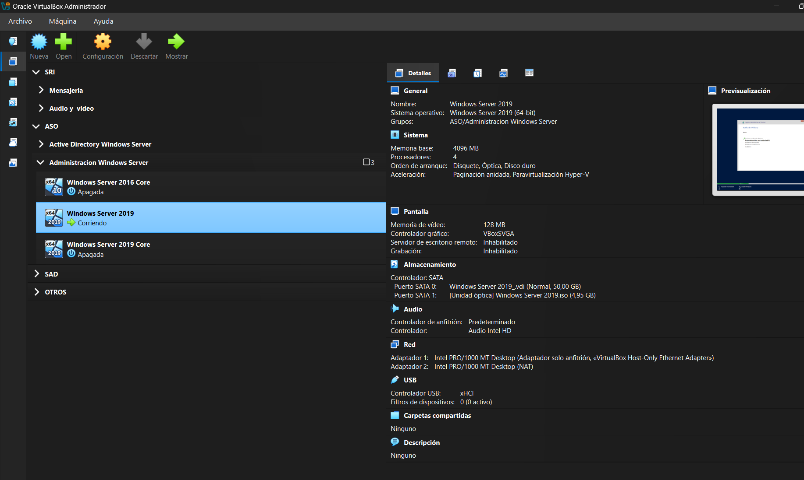
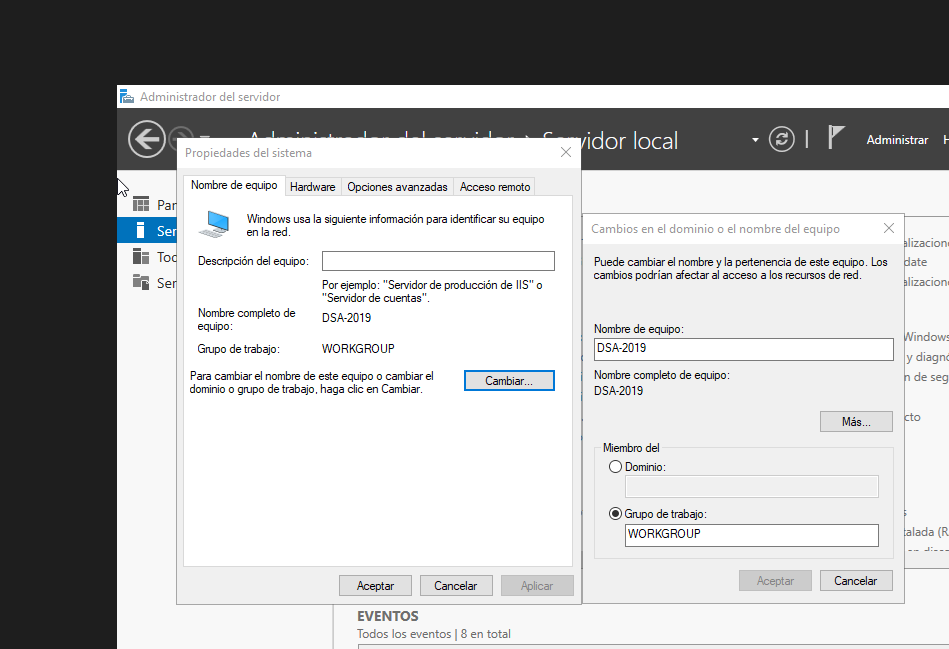
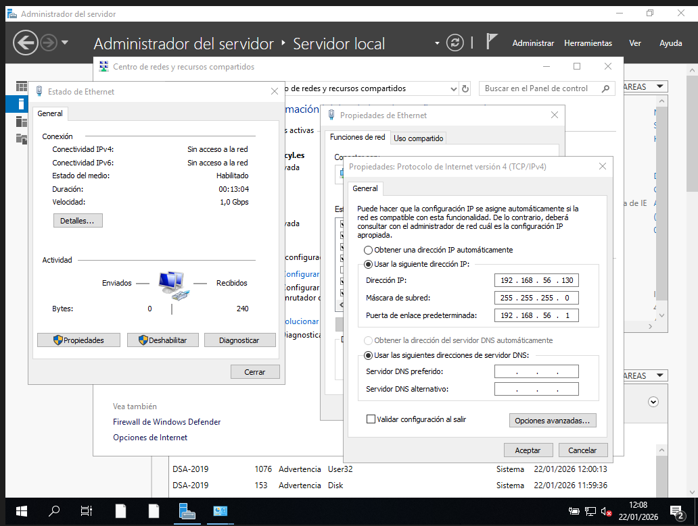
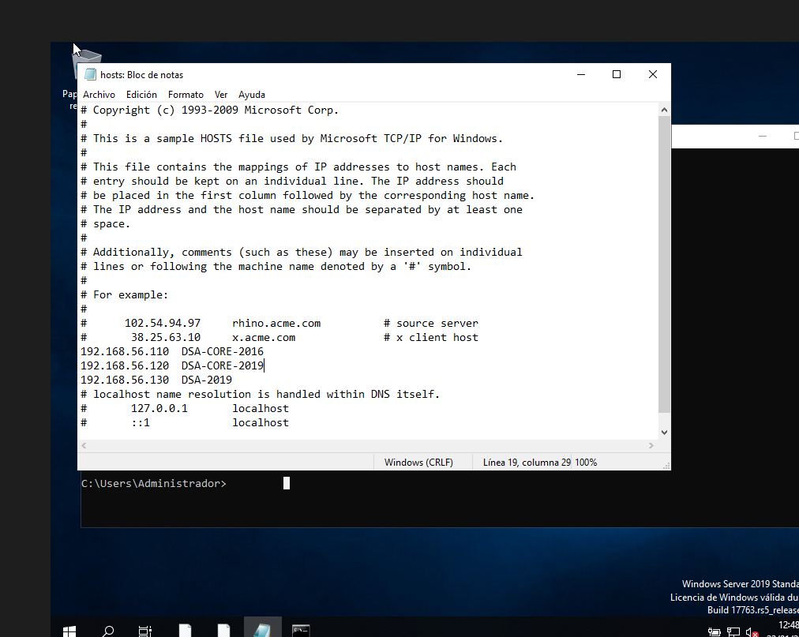
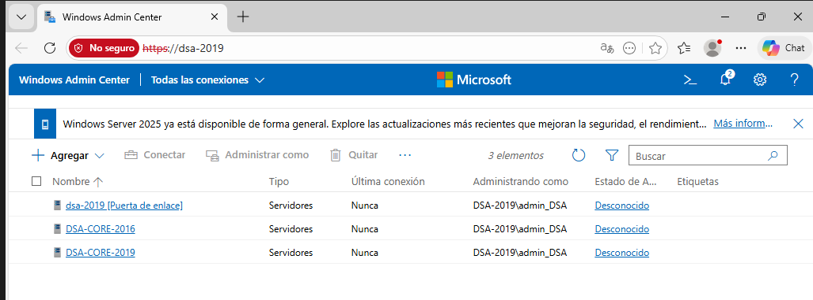

```
---------------- ADMINISTRACIÓN DE SISTEMAS INFORMÁTICOS Y REDES ----------------
---------------------------------------------------------------------------------

Módulo:                     ADMINISTRACIÓN DE SISTEMAS OPERATIVOS
Profesor:                   Víctor J. González
Unidad de Trabajo:          UT04
Práctica:                   PR0401. Administración remota de Windows
Resultados de aprendizaje:  RA4
```

# PR0401:  Administración remota con Powershell


En esta práctica vamos a realizar tareas de administración remota de un servidor en modo Core utilizando Powershell..

## 1.- Entorno virtualizado

Necesitarás la siguiente configuración de máquinas virtuales:
- **Windows Server 2019 con experiencia de escritorio** 
- **Windows Server 2019 en modo Core**
- **Windows Server 2016 en modo Core**

Todos los equipos tendrán que tener un adaptador en modo solo-anfitrión en la misma red y otro en modo NAT por si necesitaras acceso a Internet.

---



---

## 2. Preparación de las máquinas

- Comprueba la conectividad entre los tres equipos:
- Asigna **nombres a los equipo**, estos nombres serán:
  - Windows Server 2019 con entorno gráfico: `{INICIALES}-2019`
  - Windows Server 2019 en modo core: `{INICIALES}-CORE-2019`
  - Windows Server 2016 en modo core: `{INICIALES}-CORE-2016`
- Edita el fichero `hosts` de cada equipo para la habilitar la resolución local de nombres entre ellos.

---

En Windows Server Core haces dentro de powershell:

```powershell
Rename-Computer `
 -NewName DSA-CORE-2019 `
 -Restart
```

Y en Windows Server con escritorio lo cambias desde `Prioridades del Sistema`:



Ahora vamos a configurar IP estaticas para cada WS:

En Core:

```powershell
New-NetIPAddress `
 -InterfaceIndex 6 `
 -IPAddress 192.168.56.120 `
 -PrefixLength 24 `
 -DefaultGateway 192.168.56.1
```

En Escritorio:



Luego, vamos a editar el fichero `hosts`:

En Core:

```powershell
notepad C:\Windows\System32\drivers\etc\hosts
```
Y añades 
```
192.168.56.110  DSA-CORE-2016
192.168.56.120  DSA-CORE-2019
192.168.56.130  DSA-2019
```

En Escritorio:

Editas el ficherto `C:\Windows\System32\drivers\etc\hosts` y añades:



---

## 3. Configuración del acceso remoto al nuevo equipo

El objetivo es realizar los pasos necesarios para administrar los dos equipos en modo Core desde el equipo con entorno gráfico.

Para comprobar que funciona crea, desde el equipo con entorno gráfico, un usuario con privilegios de administrador llamado `admin_{iniciales}`. Si no sabes cómo hacerlo tienes una breve guía [aquí](https://intelaf.wordpress.com/2022/08/12/como-crear-usuario-administrador-desde-powershell-en-windows-11/)

---

En PowerShell de WS con Escritorio haces:

```powershell
New-LocalUser admin_DSA -Password (Read-Host -AsSecureString)
Add-LocalGroupMember Administradores admin_DSA
```

Ahora, en powershell de WS Core :

```powershell
New-LocalUser admin_DSA -Password (Read-Host -AsSecureString)
Add-LocalGroupMember Administradores admin_DSA
Enable-PSRemoting -Force
```

Y a continuacion, en el WS Escritorio haces dentro de powershell:

```powershell
Set-Item WSMan:\localhost\Client\TrustedHosts "DSA-CORE-2019,DSA-CORE-2016"
```

---

## 4. Configuración del acceso remoto sobre HTTPS

- Una vez que hayas comprobado que tienes todo bien configurado es el momento de asegurar nuestra red preparándola para que utilice **WinRM sobre HTTPS** utilizando un certificado autofirmado.
- Realiza los pasos necesarios para que la comunicación con ambos servidores utilice este mecanismo.

---

Creamos los certificados autofirmados:

En WS CORE:

```powershell
New-SelfSignedCertificate `
 -DnsName DSA-CORE-2019 `
 -CertStoreLocation Cert:\LocalMachine\My `
 -KeyLength 2048
```

Para comprobar y sacar el HASH que se ha creado haces:

```powershell
Get-ChildItem Cert:\LocalMachine\My
```

Ahora, creamos el listener desde cmd

```cmd
winrm create winrm/config/Listener?Address=*+Transport=HTTPS @{Hostname="DSA-CORE-2019"; CertificateThumbprint="87D57D316889463B1BFFD4B15F90FBDADB759725"}
```

Después, abres el puerto:

```powershell
New-NetFirewallRule -DisplayName "WinRM HTTPS" -Direction Inbound -Protocol TCP -LocalPort 5986 -Action Allow
```

A continuación, exportamos e importamos el certificado haciendo:

```powershell
Export-Certificate -Cert Cert:\LocalMachine\My\87D57D316889463B1BFFD4B15F90FBDADB759725 -FilePath C:\core2019.cer
```

Y lo copiamos en el servidor grafico, pero tenemos que crear la carpeta en el desktop y la compartimos a todos con control total:

```powershell
Copy-Item C:\core2019.cer \\DSA-2019\Compartida
```

Para acabar lo importamos desde el WS con escritorio:

```powershell
Import-Certificate -FilePath C:\Compartida\core2019.cer -CertStoreLocation Cert:\LocalMachine\Root
```

Y para comprobar que funciona hacemos:

```powershell
Enter-PSSession -ComputerName DSA-CORE-2019 -UseSSL
```

---

## 5. Configuración remota con Windows Admin Center

- Por último, configura tus equipos para poder administrarlos de forma remota utilizando **Windows Admin Center** desde el equipo con entorno gráfico.

---

Primero, tenemos que desactivar la `Configuraciuon de seguridad mejorada de IE en el WS desktop desde el apartado de servidor local.

Después, instalamos el Windows Admin Center y durante la instalacion seleccionamos la opcion de crear certificado autofirmado.

Una vez realizado lo anterior, buscamos en el navegador `https://dsa_2019/` y iniciamos sesion con el usuario admin_DSA y la contraseña que le pusiese.

Ya dentro del administrador, agregamos los otros dos servidores:

Una vez finalizado tendrias que ver algo asi:



---

## 6. Documentación

Como es habitual, tienes que documentar los pasos más relevantes que has seguido para realizar la práctica. 

---

[VOLVER A INICIO](../../../index.md)