```
---------------- ADMINISTRACIÓN DE SISTEMAS INFORMÁTICOS Y REDES ----------------
---------------------------------------------------------------------------------

Módulo:                     ADMINISTRACIÓN DE SISTEMAS OPERATIVOS
Profesor:                   Víctor J. González
Unidad de Trabajo:          UT05
Práctica:                   PR0501. Implantación de un controlador de dominio
Resultados de aprendizaje:  
```


### 1. Objetivo


Eres el nuevo administrador de sistemas del **IES San Andrés**. El centro ha decidido centralizar la gestión de usuarios y equipos, y tu primera tarea es implantar un dominio de Active Directory.

El nombre de dominio interno será: **`iessanandres.local`**

El centro tiene una estructura organizativa que debe reflejarse en el directorio activo para facilitar la gestión. La estructura académica se divide en:

- **Familia de Administración:**
    - Ciclo Superior de Administración y Finanzas (AFI)
    - Ciclo Superior de Asistencia a la Dirección (GAD)
    - Ciclo Medio de Gestión Administrativa (SCO)
- **Familia de Informática:**
    - Ciclo Superior de Desarrollo de Aplicaciones Multiplataforma (DAM)
    - Ciclo Superior de Desarrollo de Aplicaciones Web (DAW)
    - Ciclo Superior de Administración de Sistemas (ASIR)
    - Ciclo Medio de Sistemas Microinformáticos y Redes (SMR)
    - Curso de Especialización en Inteligencia Artificial y Big Data (IAyBD)

Además de los alumnos y profesores de estas familias, también existe el personal de administración y servicios (PAS).


### 2. Tareas a Realizar

Deberás realizar los siguientes pasos en tu máquina virtual de Windows Server.

#### Tarea 1: Promoción del controlador de dominio

Promueve el servidor a controlador de dominio configurando un **nuevo bosque** con el nombre de dominio raíz: **`iessanandres.local`**.

---

Primero hay que asignarle un nombre de equipo, en administrador de servidor -> Servidor Local -> Nombre de equipo. En el cuadro de dialogo que nos sale das a cambiar y cambias el nombre:

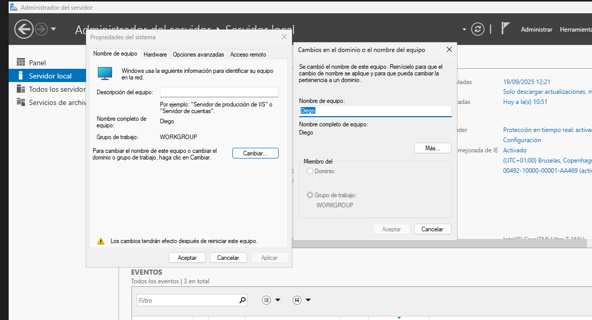

Después, hay que asignar una IP estatica, yendo a Panel de control -> Redes e Internet -> Centro de redes y recursos compartidos. Entras en las propiedades del adaptador correspondiente y asignas una IP estatica a la IPv4:

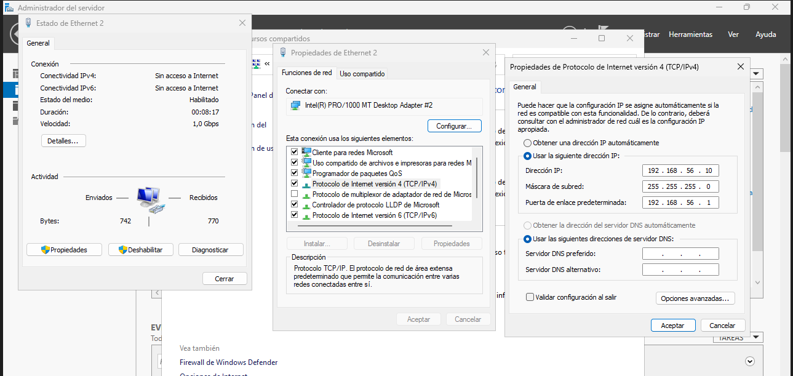

Ahora, vamos a Agregar el rol al servidor desde el administrador. Donde vamos a agregar el rol *Servicios de dominio de Active Directory*

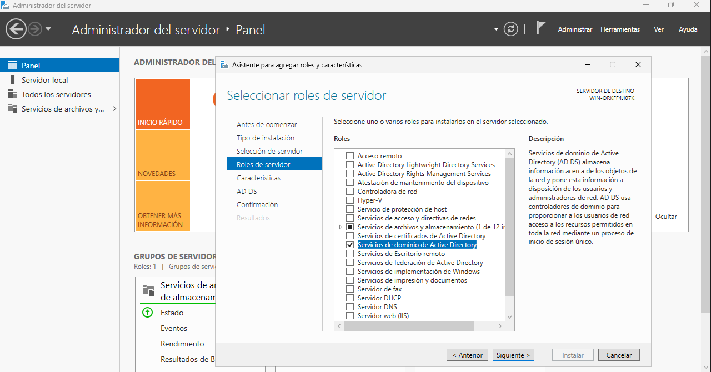

Al instalarlo se nos instala tambien el servicio DNS.

A Continuación, tenemos que configurar el controlador de dominio:

Agregamos un nuevo bosque con el nombre de *iessanandres.local* :

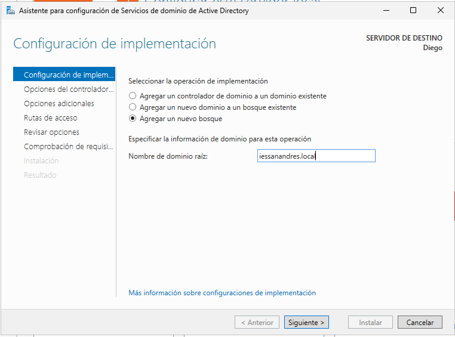

Añades una contraseña:

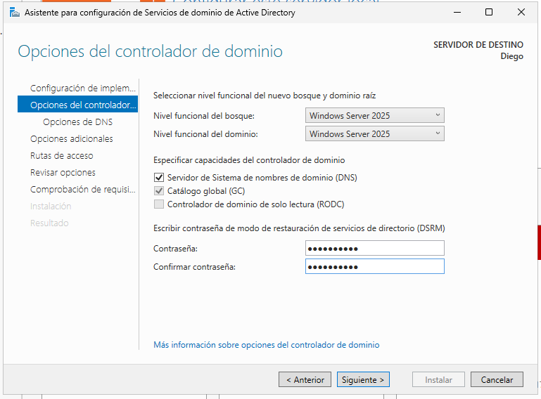

Continuas e instalas la configuración. Y reinicias el ser idor.

--- 

#### Tarea 2: Diseño de la Estructura de Unidades Organizativas (UO)

Usando la consola *"Usuarios y equipos de Active Directory" (`dsa.msc`)*, debes crear una jerarquía de Unidades Organizativas que refleje la estructura del centro.

**Requisito:** La estructura debe ser lógica y permitir aplicar políticas de forma diferenciada. Se propone la siguiente estructura (puedes mejorarla si lo justificas):

- **`IES San Andres`** (UO Raíz para la gestión del centro)
    - **`Alumnado`**
        - `Informatica`
            - `DAM`
            - `DAW`
            - `ASIR`
            - `SMR`
            - `IAyBD`
        - `Administracion`
            - `AFI`
            - `GAD`
            - `SCO`
    - **`Profesorado`**
        - `Informatica`
        - `Administracion`
    - **`Personal_PAS`** (Personal de Administración y Servicios)
    - **`_Grupos`** (UO para almacenar todos los grupos de seguridad)
    - **`_Equipos`** (UO para los equipos del dominio)
        - `Aulas_Informatica`
        - `Aulas_Administracion`
        - `Despachos`


---

Vas a al administrador de servidor -> Herramientas -> Usuarios y equipos de Active Directory.

Clic dercho en iessanandres.local -> Nuevo -> Unidad Organizativa.

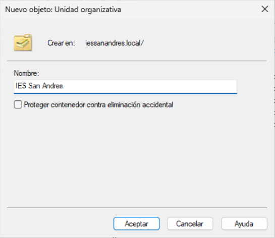

Y creas toda la estructura como en el enunciado. Quedaria asi:

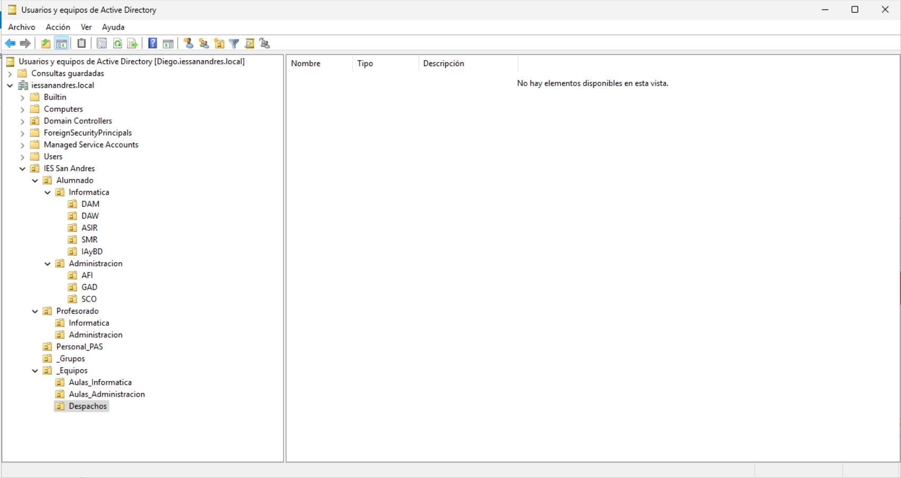

--- 

#### Tarea 3: Creación de Usuarios y Grupos

Debes poblar la estructura con algunos usuarios y grupos de ejemplo.

1.  **Crear Usuarios:**
    - Crea **2 alumnos de ejemplo** dentro de la UO `ASIR` (ej. `alu_asir_1`, `alu_asir_2`).
    - Crea **2 alumnos de ejemplo** dentro de la UO `AFI` (ej. `alu_afi_1`, `alu_afi_2`).
    - Crea **1 profesor** en la UO `Profesorado\Informatica` (ej. `prof_info_1`).
    - Crea **1 usuario** en la UO `Personal_PAS` (ej. `pas_1`).

2.  **Crear Grupos de Seguridad:**
    - Dentro de la UO `_Grupos`, crea los siguientes grupos de seguridad (Globales):
        - `GRP_Alumnos_DAM`
        - `GRP_Alumnos_AFI`
        - `GRP_Profesores_Informatica`
        - `GRP_Personal_PAS`
        - `GRP_Alumnos_General` (Un grupo que contendrá a todos los alumnos)
        - `GRP_Profesores_General` (Un grupo que contendrá a todos los profesores)

3.  **Asignar Miembros:**
    - Añade los usuarios que creaste a sus grupos correspondientes.
    - Haz que `GRP_Alumnos_DAM` y `GRP_Alumnos_AFI` sean miembros del grupo `GRP_Alumnos_General`.


---
Vamos a crear los usuario del enunciado:

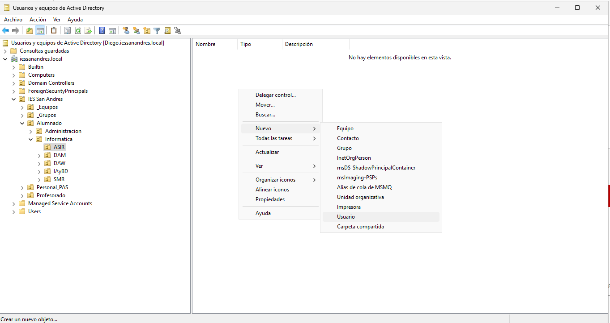

E introduces las credenciales del usuario:

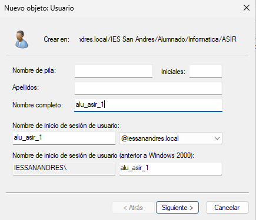

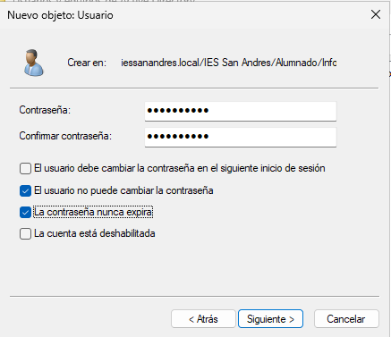

Y haces lo mismo con todos los usuarios:

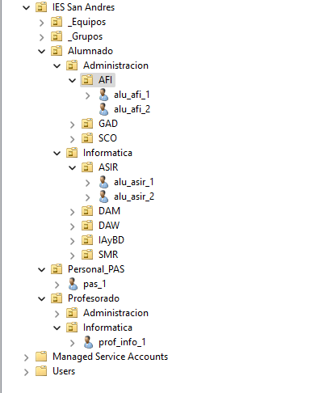

Después, vamos a crear los grupos:

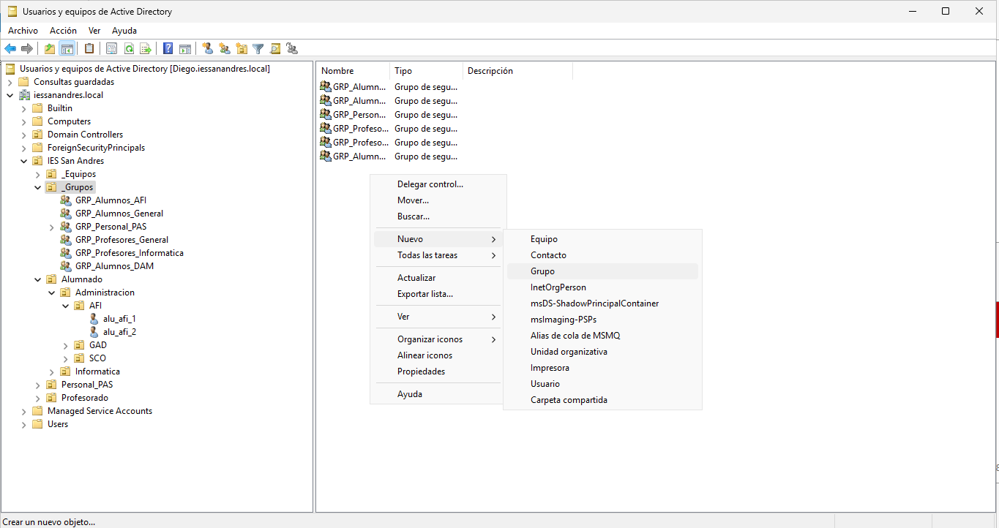

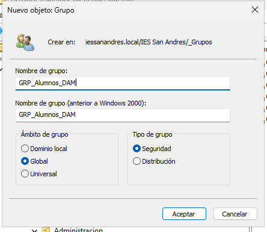

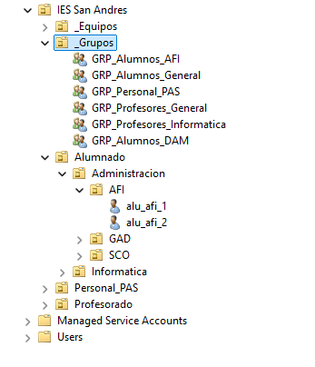

Ahora añadimos los grupos a sus grupos superiores:


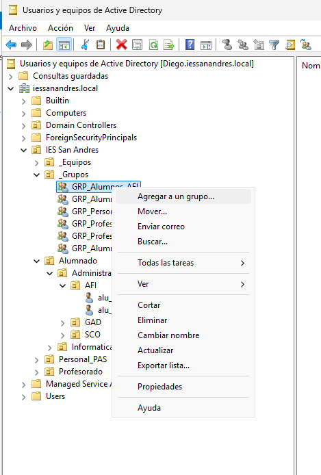

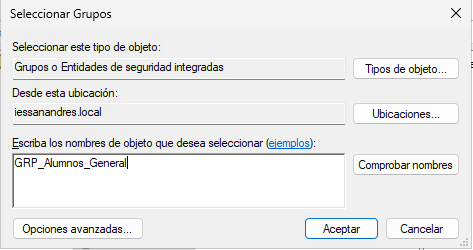

Y haces lo mismo con los usuarios creados anteriormente:

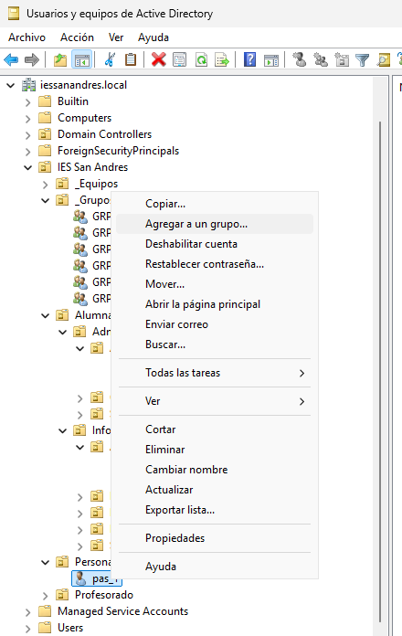

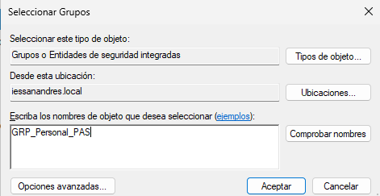

--- 

#### Tarea 4: Restricción de Horas de Inicio de Sesión

La dirección del centro ha solicitado que los alumnos solo puedan usar los equipos del dominio durante el horario lectivo.

1.  Selecciona **simultáneamente** a los 4 usuarios de tipo "alumno" que creaste (puedes usar `Ctrl + Clic`).
2.  Accede a sus **Propiedades** (esto editará las propiedades de todos a la vez).
3.  Ve a la pestaña **"Cuenta"** y haz clic en **"Horas de inicio de sesión"**.
4.  Configura las horas para que **solo se permita el inicio de sesión de Lunes a Viernes, de 8:00 a 15:00**. El resto del tiempo debe estar denegado.
5.  Verifica que el personal (profesor y PAS) sigue teniendo acceso 24/7 (que es la configuración por defecto).

---

Seleccionas los alumnos -> Propiedades -> Cuenta -> Horas de inicio de sesión ...

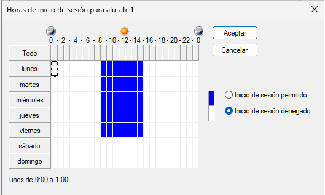

--- 

[VOLVER A INICIO](../../../index.md)