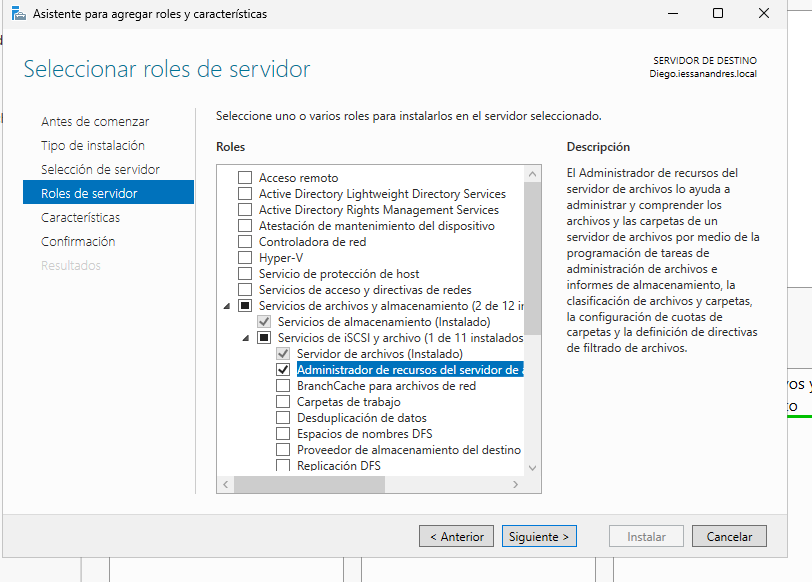
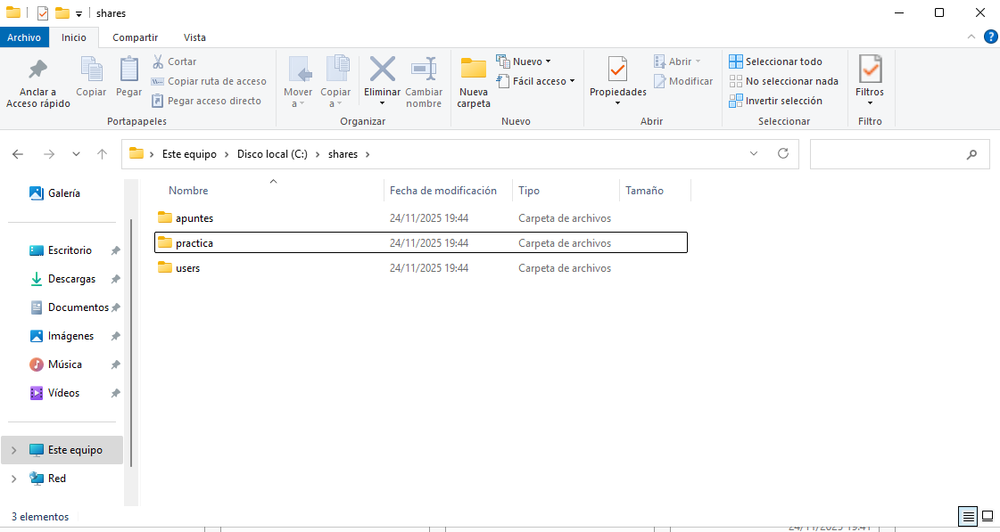
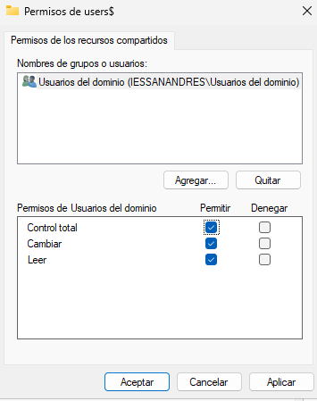
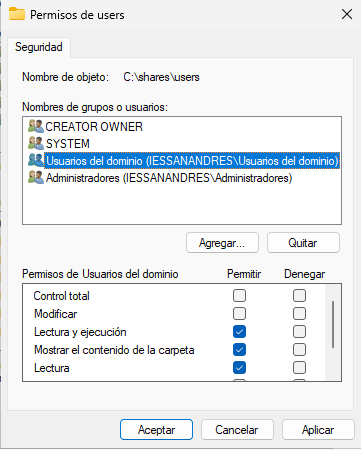

```
---------------- ADMINISTRACIÓN DE SISTEMAS INFORMÁTICOS Y REDES ----------------
---------------------------------------------------------------------------------

Módulo:                     ADMINISTRACIÓN DE SISTEMAS OPERATIVOS
Profesor:                   Víctor J. González
Unidad de Trabajo:          UT05
Práctica:                   PR0502. Carpetas personales y compartidas por grupo
Resultados de aprendizaje:  
```


# PR0502: Carpetas personales y compartidas por un grupo

Realiza los siguiente pasos en tu dominio:

## Creación de usuarios y grupos

- Siguiendo la práctica del otro día, crea una carpeta personal para todos los alumnos de ASIR.

## Carpetas personales

- Instala el *Administrador de recursos del servidor de archivos* que está dentro del rol *Servicios de archivos y almacenamiento*
- Utilizando la herramienta *Servicios de archivos y de almacenamiento* del *Administrador del servidor*, crea una carpeta para cada usuario dentro de `C:\shares` y realiza los pasos necesarios para que ambos usuarios puedan ver esta carpeta como una unidad de red identificada con la letra `H:`
- Comprueba que la carpeta de cada usuario solo pueda ser accedida por él mismo.

## Carpetas compartidas por un grupo

- Crea en `C:\shares` una carpeta llamada `apuntes` y realiza las tareas necesarias para que los alumnos de ASIR puedan acceder a ella como un espacio de almacenamiento compartido con permiso de lectura.
- Luego crea otra llamada `práctica` en la que tengan permiso de lectura y escritura


## Entrega de la tarea

Debes documentar los pasos más relevantes de la misma y entregarla en el repositorio.

---

En el administrador del servidor añadimos el rol de :



Una vez instalado, creas estos directorios en la carpeta c:/share :



Entras en las propiedades de la carpeta Users -> Compartir -> Uso compartido avanzado ... Donde marcas compartir esta carpeta, pones de nombre del recurso compartido `users$` y entras en permisos y los dejas asi:



Haces lo mismo en la carpeta apuntes pero solo dando permiso de lectura y en la carpeta practica permisos de lectura y cambiar.

Ahora en la carpeta users vamos a las Propiedades -> Seguridad -> Opciones avanzadas -> y deshabilitas la herencia.

Después, quitas permisos a Usuario y añades permisos a Usuarios de dominio asi:



