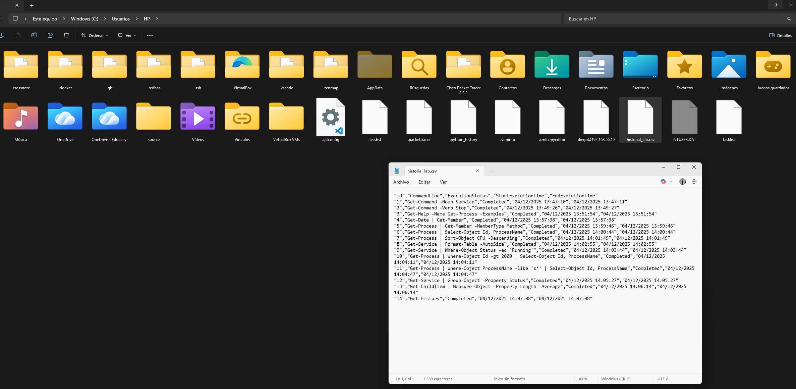

```
---------------- ADMINISTRACIÓN DE SISTEMAS INFORMÁTICOS Y REDES ----------------
---------------------------------------------------------------------------------

Módulo:                     ADMINISTRACIÓN DE SISTEMAS OPERATIVOS
Profesor:                   Víctor J. González
Unidad de Trabajo:          UT06
Práctica:                   PR0601. Introducción a PowerShell
Resultados de aprendizaje:  RA
```

# PR0601:  Introducción a Powershell

## Objetivo

El objetivo de esta práctica será demostrar destreza en la búsqueda de comandos, comprensión de objetos y uso avanzado del pipeline para filtrar y formatear datos.

---

`WIN + R` y ejecutas `Powershell`:

---

### Bloque 1: Descubrimiento y ayuda


1.  **Búsqueda por nombre (Sustantivo):** lista todos los comandos disponibles en el sistema que tengan la palabra `Service` en su nombre (noun) para identificar qué herramientas tienes para gestionar servicios.

---

Ejecutas:

```shell
Get-Command -Noun Service
```

Y veras algo asi:

```shell
PS C:\Users\HP> Get-Command -Noun Service

CommandType     Name                                               Version    Source
-----------     ----                                               -------    ------
Cmdlet          Get-Service                                        3.1.0.0    Microsoft.PowerShell.Management
Cmdlet          New-Service                                        3.1.0.0    Microsoft.PowerShell.Management
Cmdlet          Restart-Service                                    3.1.0.0    Microsoft.PowerShell.Management
Cmdlet          Resume-Service                                     3.1.0.0    Microsoft.PowerShell.Management
Cmdlet          Set-Service                                        3.1.0.0    Microsoft.PowerShell.Management
Cmdlet          Start-Service                                      3.1.0.0    Microsoft.PowerShell.Management
Cmdlet          Stop-Service                                       3.1.0.0    Microsoft.PowerShell.Management
Cmdlet          Suspend-Service                                    3.1.0.0    Microsoft.PowerShell.Management
```

---

2.  **Búsqueda por acción (Verbo):** lista todos los comandos disponibles cuya acción sea `Stop` (detener), independientemente de lo que detengan.
   
---

Ejecutas:

```shell
Get-Command -Verb Stop
```

Y veras algo asi:

```shell
PS C:\Users\HP> Get-Command -Verb Stop

CommandType     Name                                               Version    Source
-----------     ----                                               -------    ------
Function        Stop-DscConfiguration                              1.1        PSDesiredStateConfiguration
Function        Stop-Dtc                                           1.0.0.0    MsDtc
Function        Stop-DtcTransactionsTraceSession                   1.0.0.0    MsDtc
Function        Stop-EtwTraceSession                               1.0.0.0    EventTracingManagement
Function        Stop-NetEventSession                               1.0.0.0    NetEventPacketCapture
Function        Stop-PcsvDevice                                    1.0.0.0    PcsvDevice
Function        Stop-ScheduledTask                                 1.0.0.0    ScheduledTasks
Function        Stop-StorageDiagnosticLog                          2.0.0.0    Storage
Function        Stop-StorageJob                                    2.0.0.0    Storage
Function        Stop-Trace                                         1.0.0.0    PSDiagnostics
Cmdlet          Stop-AppvClientConnectionGroup                     1.0.0.0    AppvClient
Cmdlet          Stop-AppvClientPackage                             1.0.0.0    AppvClient
Cmdlet          Stop-Computer                                      3.1.0.0    Microsoft.PowerShell.Management
Cmdlet          Stop-DtcDiagnosticResourceManager                  1.0.0.0    MsDtc
Cmdlet          Stop-Job                                           3.0.0.0    Microsoft.PowerShell.Core
Cmdlet          Stop-Process                                       3.1.0.0    Microsoft.PowerShell.Management
Cmdlet          Stop-ReFSDedupJob                                  2.0.0.0    Microsoft.ReFsDedup.Commands
Cmdlet          Stop-Service                                       3.1.0.0    Microsoft.PowerShell.Management
Cmdlet          Stop-Transcript                                    3.0.0.0    Microsoft.PowerShell.Host
Cmdlet          Stop-VM                                            2.0.0.0    Hyper-V
Cmdlet          Stop-VMFailover                                    2.0.0.0    Hyper-V
Cmdlet          Stop-VMInitialReplication                          2.0.0.0    Hyper-V
Cmdlet          Stop-VMReplication                                 2.0.0.0    Hyper-V
Cmdlet          Stop-VMTrace                                       2.0.0.0    Hyper-V
```

---

3.  **Uso de la ayuda:** muestra por pantalla la ayuda detallada del comando `Get-Process`, pero asegúrate de que se muestren específicamente los **ejemplos** de uso.

---

Ejecutas:

```shell
Get-Help -Name Get-Process -Examples
```

Aunque igual tienes que hacer primero:

```shell
Update-Help
```

Y veras algo asi:

```shell
PS C:\Users\HP> Get-Help -Name Get-Process -Examples

NOMBRE
    Get-Process

SINOPSIS
    Gets the processes that are running on the local computer or a remote computer.


    --------- Example 1: Get a list of all running processes on the local computer ---------

    ```powershell
    Get-Process
    ```

    This command gets a list of all running processes on the local computer. For a definition of each
    display column, see the [NOTES](#notes) section.

    To see all properties of a **Process** object, use `Get-Process | Get-Member`. By default,
    PowerShell displays certain property values using units such as kilobytes (K) and megabytes (M). The
    actual values when accessed with the member-access operator (`.`) are in bytes.

     --------- Example 2: Display detailed information about one or more processes ---------

    ```powershell
    Get-Process winword, explorer | Format-List *
    ```

    This pipeline displays detailed information about the `winword` and `explorer` processes on the
    computer. It uses the **Name** parameter to specify the processes, but it omits the optional
    parameter name. The pipeline operator (`|`) pipes **Process** objects to the `Format-List`
    cmdlet, which displays all available properties (`*`) and their values for each object.

    You can also identify the processes by their process IDs. For instance, `Get-Process -Id 664, 2060`.

     --------- Example 3: Get all processes with a working set greater than a specified size ---------

    ```powershell
    Get-Process | Where-Object { $_.WorkingSet -gt 20971520 }
    Get-Process | Where-Object WorkingSet -GT 20MB
    ```

    The `Get-Process` cmdlet returns the running processes. The output is piped to the `Where-Object`
    cmdlet, which selects the objects with a **WorkingSet** value greater than 20,971,520 bytes.

    In the first example, `Where-Object` uses a scriptblock to compare the **WorkingSet** property of
    each **Process** object. In the second example, the `Where-Object` cmdlet uses the simplified syntax
    to compare the **WorkingSet** property. In this case, `-GT` is a parameter, not a comparison
    operator. The second example also uses a
    [numeric literal suffix](../Microsoft.PowerShell.Core/About/about_Numeric_Literals.md) as a concise
    alternative to `20971520`. In PowerShell, `MB` represents a mebibyte (MiB) multiplier. `20MB` is
    equal to 20,971,520 bytes.

     --------- Example 4: Display processes on the computer in groups based on priority ---------

    ```powershell
    $processes = Get-Process
    $processes | Sort-Object { $_.PriorityClass } | Format-Table -View Priority
    ```

    These commands display processes on the computer in groups based on their
    [priority class](/dotnet/api/system.diagnostics.processpriorityclass). The first command gets all
    processes on the computer and stores them in the `$processes` variable.

    The second command pipes the **Process** objects stored in the `$processes` variable to the
    `Sort-Object` cmdlet, then to the `Format-Table` cmdlet, which formats the processes using the
    **Priority** view.

    The **Priority** view, and other views, are defined in the `.ps1xml` format files in the PowerShell
    home directory (`$PSHOME`).

     --------- Example 5: Add a property to the default `Get-Process` output display ---------

    ```powershell
    Get-Process -Name powershell | Format-Table -Property @(
        'Handles'
        @{ Name = 'NPM(K)'; Expression = { [int] ($_.NPM / 1KB) } }
        @{ Name = 'PM(K)';  Expression = { [int] ($_.PM / 1KB) } }
        @{ Name = 'WS(K)';  Expression = { [int] ($_.WS / 1KB) } }
        @{ Name = 'CPU(s)'; Expression = { if ($_.CPU) { $_.CPU.ToString('N') } } }
        'Id'
        @{ Name = 'SI'; Expression = 'SessionId' }
        'ProcessName'
        'StartTime'
    ) -AutoSize
    ```

    ```Output
    Handles NPM(K) PM(K) WS(K) CPU(s)   Id SI ProcessName StartTime
    ------- ------ ----- ----- ------   -- -- ----------- ---------
        655     34 69424 83424 2.20   4240  1 powershell  4/14/2025 10:40:10 AM
        572     36 68768 57260 7.41   4968  1 powershell  4/13/2025 3:33:50 PM
        405     26 38144 30340 1.80   8776  1 powershell  4/14/2025 9:54:27 AM
    ```

    This example retrieves processes from the local computer and pipes each **Process** object to the
    `Format-Table` cmdlet. `Format-Table` recreates the default output display of a **Process** object
    using a mixture of property names and
    [calculated properties](../Microsoft.PowerShell.Core/About/about_Calculated_Properties.md). The
    display includes an additional **StartTime** property not present in the default display.

     --------- Example 6: Get version information for a process ---------

    ```powershell
    Get-Process -Name powershell -FileVersionInfo
    ```

    ```Output
    ProductVersion   FileVersion      FileName
    --------------   -----------      --------
    10.0.19041.320   10.0.19041.32... C:\Windows\System32\WindowsPowerShell\v1.0\powershell.exe
    ```

    This command uses the **FileVersionInfo** parameter to get file version information for the main
    module of the `powershell` process. The main module is the file used to start the process, which
    in this case is `powershell.exe`.

    To use this command with processes that you don't own on Windows Vista and later versions of
    Windows, you must run PowerShell with elevated user rights (**Run as administrator**).

     --------- Example 7: Get modules loaded with the specified process ---------

    ```powershell
    Get-Process -Name SQL* -Module
    ```

    This command uses the **Module** parameter to get the modules loaded by all processes with a name
    beginning with `SQL`.

    To use this command with processes that you don't own on Windows Vista and later versions of
    Windows, you must run PowerShell with elevated user rights (**Run as administrator**).

     --------- Example 8: Find the owner of a process ---------

    ```powershell
    Get-Process -Name powershell -IncludeUserName
    ```

    ```Output
    Handles      WS(K)   CPU(s)     Id UserName            ProcessName
    -------      -----   ------     -- --------            -----------
        782     132080     2.08   2188 DOMAIN01\user01     powershell
    ```

    ```powershell
    Get-CimInstance -ClassName Win32_Process -Filter "name='powershell.exe'" |
        Invoke-CimMethod -MethodName GetOwner
    ```

    ```Output
    Domain   ReturnValue User   PSComputerName
    ------   ----------- ----   --------------
    DOMAIN01           0 user01
    ```

    The first command shows how to get the owner of a process. The **IncludeUserName** parameter
    requires elevated user rights (**Run as Administrator**). The output reveals that the owner is
    `DOMAIN01\user01`.

    The second pipeline shows a different way to get the owner of a process using `Get-CimInstance` and
    `Invoke-CimMethod`. The **Win32_Process** class with a filter retrieves `powershell` processes and
    the invoked `GetOwner()` method returns information on the process's **Domain** and **User**. This
    method doesn't require elevated user rights.

     --------- Example 9: Use an automatic variable to identify the process hosting the current session ---------

    ```powershell
    Get-Process -Name powershell
    ```

    ```Output
    Handles  NPM(K)    PM(K)      WS(K)     CPU(s)     Id  SI ProcessName
    -------  ------    -----      -----     ------     --  -- -----------
        561      44    47564      40740       6.48   2604   1 powershell
        642      40    72040      24372      23.53   3576   1 powershel
    ```

    ```powershell
    Get-Process -Id $PID
    ```

    ```Output
    Handles  NPM(K)    PM(K)      WS(K)     CPU(s)     Id  SI ProcessName
    -------  ------    -----      -----     ------     --  -- -----------
        647      40    72464      30716      23.67   3576   1 powershell
    ```

    These commands show how to use the `$PID` automatic variable to identify the process that's hosting
    the current PowerShell session. You can use this method to distinguish the host process from other
    `powershell` processes that you might want to control.

    The first command gets all `powershell` processes running. The second command gets the `powershell`
    process that's hosting the current session.

     --------- Example 10: Get all processes that have a main window title and display them in a table ---------

    ```powershell
    Get-Process |
        Where-Object -Property MainWindowTitle |
        Format-Table -Property Id, Name, MainWindowTitle -AutoSize
    ```

    This pipeline gets all processes that have a main window title, and displays them in a table with
    the process ID and name.

    **MainWindowTitle** is one of many useful properties of the **Diagnostics.Process** object type that
    `Get-Process` returns. To view all properties, use `Get-Process | Get-Member`.
```

---

### Bloque 2: Exploración de objetos

4.  **Introspección de tipos:** ejecuta el comando para obtener la fecha actual (`Get-Date`) pero canaliza su salida para ver la lista de sus **Miembros** (Members).
      * Responde: ¿Cuál es el `TypeName` del objeto devuelto?.

---

Ejecutas:

```shell
Get-Date | Get-Member
```
Y veras algo asi:

```shell
PS C:\Users\HP> Get-Date | Get-Member


   TypeName: System.DateTime

Name                 MemberType     Definition
----                 ----------     ----------
Add                  Method         datetime Add(timespan value)
AddDays              Method         datetime AddDays(double value)
AddHours             Method         datetime AddHours(double value)
AddMilliseconds      Method         datetime AddMilliseconds(double value)
AddMinutes           Method         datetime AddMinutes(double value)
AddMonths            Method         datetime AddMonths(int months)
AddSeconds           Method         datetime AddSeconds(double value)
AddTicks             Method         datetime AddTicks(long value)
AddYears             Method         datetime AddYears(int value)
CompareTo            Method         int CompareTo(System.Object value), int CompareTo(datetime value), int IComparable.Comp...
Equals               Method         bool Equals(System.Object value), bool Equals(datetime value), bool IEquatable[datetime...
GetDateTimeFormats   Method         string[] GetDateTimeFormats(), string[] GetDateTimeFormats(System.IFormatProvider provi...
GetHashCode          Method         int GetHashCode()
GetObjectData        Method         void ISerializable.GetObjectData(System.Runtime.Serialization.SerializationInfo info, S...
GetType              Method         type GetType()
GetTypeCode          Method         System.TypeCode GetTypeCode(), System.TypeCode IConvertible.GetTypeCode()
IsDaylightSavingTime Method         bool IsDaylightSavingTime()
Subtract             Method         timespan Subtract(datetime value), datetime Subtract(timespan value)
ToBinary             Method         long ToBinary()
ToBoolean            Method         bool IConvertible.ToBoolean(System.IFormatProvider provider)
ToByte               Method         byte IConvertible.ToByte(System.IFormatProvider provider)
ToChar               Method         char IConvertible.ToChar(System.IFormatProvider provider)
ToDateTime           Method         datetime IConvertible.ToDateTime(System.IFormatProvider provider)
ToDecimal            Method         decimal IConvertible.ToDecimal(System.IFormatProvider provider)
ToDouble             Method         double IConvertible.ToDouble(System.IFormatProvider provider)
ToFileTime           Method         long ToFileTime()
ToFileTimeUtc        Method         long ToFileTimeUtc()
ToInt16              Method         int16 IConvertible.ToInt16(System.IFormatProvider provider)
ToInt32              Method         int IConvertible.ToInt32(System.IFormatProvider provider)
ToInt64              Method         long IConvertible.ToInt64(System.IFormatProvider provider)
ToLocalTime          Method         datetime ToLocalTime()
ToLongDateString     Method         string ToLongDateString()
ToLongTimeString     Method         string ToLongTimeString()
ToOADate             Method         double ToOADate()
ToSByte              Method         sbyte IConvertible.ToSByte(System.IFormatProvider provider)
ToShortDateString    Method         string ToShortDateString()
ToShortTimeString    Method         string ToShortTimeString()
ToSingle             Method         float IConvertible.ToSingle(System.IFormatProvider provider)
ToString             Method         string ToString(), string ToString(string format), string ToString(System.IFormatProvid...
ToType               Method         System.Object IConvertible.ToType(type conversionType, System.IFormatProvider provider)
ToUInt16             Method         uint16 IConvertible.ToUInt16(System.IFormatProvider provider)
ToUInt32             Method         uint32 IConvertible.ToUInt32(System.IFormatProvider provider)
ToUInt64             Method         uint64 IConvertible.ToUInt64(System.IFormatProvider provider)
ToUniversalTime      Method         datetime ToUniversalTime()
DisplayHint          NoteProperty   DisplayHintType DisplayHint=DateTime
Date                 Property       datetime Date {get;}
Day                  Property       int Day {get;}
DayOfWeek            Property       System.DayOfWeek DayOfWeek {get;}
DayOfYear            Property       int DayOfYear {get;}
Hour                 Property       int Hour {get;}
Kind                 Property       System.DateTimeKind Kind {get;}
Millisecond          Property       int Millisecond {get;}
Minute               Property       int Minute {get;}
Month                Property       int Month {get;}
Second               Property       int Second {get;}
Ticks                Property       long Ticks {get;}
TimeOfDay            Property       timespan TimeOfDay {get;}
Year                 Property       int Year {get;}
DateTime             ScriptProperty System.Object DateTime {get=if ((& { Set-StrictMode -Version 1; $this.DisplayHint }) -i...

```

El `TypeName` del objeto devuelto es `System.DataTime`.

---

5.  **Identificación de Propiedades vs Métodos:** usando el comando `Get-Member` sobre un proceso cualquiera (ej: `Get-Process`), identifica el nombre de un **Método** que permita finalizar (matar) el proceso.

---

Ejecutas:

```shell
Get-Process | Get-Member -MemberType Method
```

Y veras algo asi:

```shell
PS C:\Users\HP> Get-Process | Get-Member -MemberType Method


   TypeName: System.Diagnostics.Process

Name                      MemberType Definition
----                      ---------- ----------
BeginErrorReadLine        Method     void BeginErrorReadLine()
BeginOutputReadLine       Method     void BeginOutputReadLine()
CancelErrorRead           Method     void CancelErrorRead()
CancelOutputRead          Method     void CancelOutputRead()
Close                     Method     void Close()
CloseMainWindow           Method     bool CloseMainWindow()
CreateObjRef              Method     System.Runtime.Remoting.ObjRef CreateObjRef(type requestedType)
Dispose                   Method     void Dispose(), void IDisposable.Dispose()
Equals                    Method     bool Equals(System.Object obj)
GetHashCode               Method     int GetHashCode()
GetLifetimeService        Method     System.Object GetLifetimeService()
GetType                   Method     type GetType()
InitializeLifetimeService Method     System.Object InitializeLifetimeService()
Kill                      Method     void Kill()
Refresh                   Method     void Refresh()
Start                     Method     bool Start()
ToString                  Method     string ToString()
WaitForExit               Method     bool WaitForExit(int milliseconds), void WaitForExit()
WaitForInputIdle          Method     bool WaitForInputIdle(int milliseconds), bool WaitForInputIdle()
```

---

### Bloque 3: El Pipeline (selección y ordenación)


6.  **Selección de columnas:** obtén la lista de todos los procesos, pero muestra por pantalla **únicamente** las propiedades `Id` y `ProcessName`. El resto de información debe ser descartada.

---

Ejecutas:

```shell
Get-Process | Select-Object Id, ProcessName
```

Y veras algo asi:

```shell
PS C:\Users\HP> Get-Process | Select-Object Id, ProcessName

   Id ProcessName
   -- -----------
 9616 AggregatorHost
25224 AppActions
 3460 AppHelperCap
19788 ApplicationFrameHost
19424 audiodg
 3220 backgroundTaskHost
 4500 backgroundTaskHost
11636 backgroundTaskHost
16924 backgroundTaskHost
 6000 Cobian.Reflector.VSCRequester
 1416 Code
 2468 Code
 3900 Code
 6084 Code
15572 Code
16208 Code
19784 Code
20112 Code
22260 Code
24200 Code
25288 Code
26248 Code
 2792 conhost
 9860 conhost
16812 conhost
 1160 csrss
26672 csrss
 3464 ctfmon
 3300 DiagsCap
 7608 dllhost
24364 dllhost
 6048 DtsApo4Service
13736 dwm
19480 explorer
10760 FileCoAuth
 8372 FileSyncHelper
 1604 fontdrvhost
24636 fontdrvhost
 6056 HPCommRecovery
26504 HPEnhancedLighting.Bg
25848 HPLJUTSCH
23352 HPMediaNetwork
 6104 HPPrintScanDoctorService
 8536 HPStatusAlerts
18892 HPSystemEventUtilityBackground
18700 HPSystemEventUtilityHost
14032 hpwuschd2
    0 Idle
 5444 IntelAudioService
 6324 IntelGraphicsSoftware.Service
16844 ipf_helper
 6364 ipf_uf
 6040 ipfsvc
20288 LockApp
 1424 LsaIso
 1432 lsass
 3680 Memory Compression
16276 Microsoft.Management.Services.IntuneWindowsAgent
 8544 MicrosoftStartFeedProvider
 6556 MpDefenderCoreService
 3888 msedge
 4684 msedge
 5740 msedge
 8280 msedge
10228 msedge
12344 msedge
13460 msedge
14004 msedge
14436 msedge
14944 msedge
17448 msedge
17556 msedge
17588 msedge
18188 msedge
18844 msedge
24332 msedge
25768 msedge
26396 msedge
26908 msedge
27440 msedge
 9740 msedgewebview2
10964 msedgewebview2
12640 msedgewebview2
15856 msedgewebview2
16688 msedgewebview2
17140 msedgewebview2
17232 msedgewebview2
18952 msedgewebview2
24652 msedgewebview2
24664 msedgewebview2
24896 msedgewebview2
25612 msedgewebview2
27012 msedgewebview2
 6680 MsMpEng
  860 ms-teams
12168 ms-teams
 3544 NetworkCap
 6840 NgcIso
10944 NisSrv
16320 Notepad
26104 Notepad
19484 OfficeClickToRun
 7384 OmenCommandCenterBackground
26008 OmenInstallMonitor
 5140 OneApp.IGCC.WinService
12560 OneDrive
15872 OneDrive
12396 OneDrive.Sync.Service
25872 OpenConsole
 7700 OpenWith
11828 OverlayHelper
20264 PhoneExperienceHost
16036 powershell
16232 powershell
 9844 PresentMonService
  256 Registry
 6416 RtkAudUService64
16860 RtkAudUService64
20528 RtkAudUService64
 6400 RtkBtManServ
14884 RuntimeBroker
16056 RuntimeBroker
23768 RuntimeBroker
26228 RuntimeBroker
26764 RuntimeBroker
26860 RuntimeBroker
27300 RuntimeBroker
18012 SearchHost
14604 SearchIndexer
  212 Secure System
16348 SecurityHealthService
20508 SecurityHealthSystray
 1404 services
 6780 ShellExperienceHost
 5132 ShellHost
21808 sihost
 6012 smartscreen
  760 smss
 5776 spoolsv
18312 StartMenuExperienceHost
 8416 StoreDesktopExtension
  428 svchost
 1000 svchost
 1164 svchost
 1260 svchost
 1576 svchost
 1756 svchost
 1844 svchost
 2164 svchost
 2172 svchost
 2180 svchost
 2188 svchost
 2196 svchost
 2204 svchost
 2328 svchost
 2336 svchost
 2364 svchost
 2428 svchost
 2444 svchost
 2484 svchost
 2504 svchost
 2512 svchost
 2528 svchost
 2592 svchost
 2804 svchost
 2936 svchost
 2980 svchost
 3076 svchost
 3100 svchost
 3288 svchost
 3360 svchost
 3516 svchost
 3556 svchost
 3628 svchost
 3640 svchost
 3704 svchost
 3868 svchost
 3972 svchost
 3988 svchost
 4008 svchost
 4068 svchost
 4080 svchost
 4160 svchost
 4204 svchost
 4244 svchost
 4300 svchost
 4312 svchost
 4596 svchost
 4644 svchost
 4688 svchost
 5080 svchost
 5112 svchost
 5232 svchost
 5304 svchost
 5320 svchost
 5412 svchost
 5648 svchost
 5916 svchost
 5940 svchost
 5992 svchost
 6020 svchost
 6064 svchost
 6096 svchost
 6408 svchost
 6464 svchost
 6484 svchost
 6992 svchost
 7232 svchost
 7932 svchost
 7940 svchost
 8380 svchost
 9192 svchost
 9300 svchost
10104 svchost
10136 svchost
10180 svchost
10316 svchost
10408 svchost
10956 svchost
11288 svchost
11408 svchost
11732 svchost
12212 svchost
13300 svchost
14376 svchost
14456 svchost
15176 svchost
15884 svchost
16032 svchost
16584 svchost
16980 svchost
17696 svchost
18028 svchost
18368 svchost
18384 svchost
22800 svchost
23136 svchost
23664 svchost
24036 svchost
24624 svchost
25608 svchost
26356 svchost
 7872 SynTPEnh
 3796 SynTPEnhService
 3468 SysInfoCap
    4 System
 7732 SystemOptimizer
 4540 SystemSettings
15200 taskhostw
21964 taskhostw
20484 TextInputHost
 3636 TouchpointAnalyticsClientService
 4984 unsecapp
14468 unsecapp
 3784 UserOOBEBroker
 6580 VBoxNetDHCP
15928 VBoxNetDHCP
16648 VBoxNetDHCP
20284 VBoxSDS
11968 VBoxSVC
20520 VirtualBox
 5168 vmcompute
10656 vmmemCmZygote
 3732 vmms
 8772 WidgetBoard
25628 WidgetService
 3484 WindowsTerminal
 1264 wininit
 3936 winlogon
 3904 WmiPrvSE
13136 WmiPrvSE
 6472 WMIRegistrationService
 6496 wslservice
 1652 WUDFHost
 1784 WUDFHost
 1968 WUDFHost
 2320 WUDFHost
```

---

7.  **Ordenación básica:** lista todos los procesos del sistema, ordenados por su consumo de `CPU` de forma **descendente** (el que más consume primero).

---

Ejecutas:

```shell
Get-Process | Sort-Object CPU -Descending
```

Y veras algo asi:

```shell
PS C:\Users\HP> Get-Process | Sort-Object CPU -Descending

Handles  NPM(K)    PM(K)      WS(K)     CPU(s)     Id  SI ProcessName
-------  ------    -----      -----     ------     --  -- -----------
   2389     260   203260     250040     687,89  17556  23 msedge
    812      60   544872     278768     485,70  13460  23 msedge
   2560     152   352592     117172     438,20   7384  23 OmenCommandCenterBackground
   4013     108   237000     285908     275,05  19480  23 explorer
    588      51   368912     355288     266,30  26248  23 Code
    526      76   639360     491712     239,45  18952  23 msedgewebview2
    506      45    38748      49248     134,94   4684  23 msedge
    519      34   241860     229048     116,97  16208  23 Code
    496      55   460176     365848     105,08   1416  23 Code
   1318      68   125840     156796      94,11  20112  23 Code
   1578      61    87316      95560      85,56  10964  23 msedgewebview2
   1163      68   122576      56900      82,97  15872  23 OneDrive
    646      35   109180      40956      73,55  12396  23 OneDrive.Sync.Service
    490      47   205996      22836      68,97  17448  23 msedge
   1335      71    87232      56428      57,58  12168  23 ms-teams
    672      38   166056     222700      53,48  12344  23 msedge
    707      47   371900     179920      45,08  27012  23 msedgewebview2
    567      22     9056      17336      38,84   3464  23 ctfmon
    551      35   126264     176080      28,56  18188  23 msedge
    182      11     2048       7016      28,38  16844  23 ipf_helper
    799      24     8392      22292      20,34  21808  23 sihost
    908      39    55996      22480      20,27  20484  23 TextInputHost
    334      30    97120     102456      15,77  15572  23 Code
    476      27    73904      62056      15,20  20520  23 VirtualBox
   1382      63   110640      28512      12,92    860  23 ms-teams
    457      29    32788      18696      12,19  18892  23 HPSystemEventUtilityBackground
    378      29   136028      14228      10,88  25768  23 msedge
   1078      50    82304      74216      10,25  18012  23 SearchHost
    403      29   109316     202008      10,20  24200  23 Code
   3442      18     8832      27340       9,67  11968  23 VBoxSVC
    718      36    53108       6588       9,05   7732  23 SystemOptimizer
   1083      65   115312      43976       9,02  12560  23 OneDrive
    395      27    13992      21460       7,73  25612  23 msedgewebview2
   1089      53   104196      78320       7,39  18312  23 StartMenuExperienceHost
    604      29    36148       5100       7,06  11828  23 OverlayHelper
    361      32    64536      45820       6,16  16688  23 msedgewebview2
   1157      51    37760      45040       6,06  15856  23 msedgewebview2
    187      21    64364     103324       5,72  25288  23 Code
    866      38    89512     115072       5,39   6780  23 ShellExperienceHost
   1403     106    81104      21756       5,33  20264  23 PhoneExperienceHost
    859      34    16700      38792       5,28  23768  23 RuntimeBroker
    330      29    81512      99620       5,05   2468  23 Code
    346      26    51164      70824       4,41  14436  23 msedge
    585      24    10372      27384       4,16   8544  23 MicrosoftStartFeedProvider
    195      13    12656       9816       3,72  18844  23 msedge
    852      20    10696      22180       3,45  22800  23 svchost
   1539      74   144988        508       3,19   4540  23 SystemSettings
    323      43     9728      12588       3,13  15200  23 taskhostw
    375      17     5020      18076       2,95  15176  23 svchost
    569      33    75556     131920       2,91   3484  23 WindowsTerminal
    350      34   102012      90796       2,75   6084  23 Code
    925      47   103948     167340       2,73  26104  23 Notepad
    528      29    54764      53248       2,53  16036  23 powershell
    385      27    53996      24712       2,52  26396  23 msedge
    351      21    15384      47340       2,33   3900  23 Code
    329      18     5492       7800       2,20  25628  23 WidgetService
    370      14    18944      31752       2,11   6580  23 VBoxNetDHCP
    591      28    32980       4340       2,03  26008  23 OmenInstallMonitor
    454      31   127116      34224       2,03  24652  23 msedgewebview2
    295      23    34592      78352       2,00  24332  23 msedge
    403      16    26516       7452       1,94  16860  23 RtkAudUService64
    507      18    10164      15396       1,89  24624  23 svchost
    377      22    14996      18872       1,50  17232  23 msedgewebview2
    177      12    10424       6704       1,50   9740  23 msedgewebview2
    242      16     9408       8768       1,30  14004  23 msedge
    296      18    12192       4436       1,22  25224  23 AppActions
    242      16     8756      12048       1,20  10228  23 msedge
    243      16     8924       9944       1,08  17140  23 msedgewebview2
    328      18     5048       7924       1,06   8772  23 WidgetBoard
    727      39    62580     130048       1,05   7700  23 OpenWith
    673      32   107584     129304       1,17  16232  23 powershell
    346      15    21800      26812       1,00  19424   0 audiodg
    490      24     7620      43928       0,98  26764  23 RuntimeBroker
    288      15     5404       8196       0,97  27300  23 RuntimeBroker
    506      17     7980       6056       0,84   7872  23 SynTPEnh
    242      13     3172      13076       0,77  14884  23 RuntimeBroker
    313      23    26036       9308       0,75   3888  23 msedge
    284      20    24256      54888       0,75  14944  23 msedge
    580      33    41232      18368       0,72  23352  23 HPMediaNetwork
    578      28    49688      82428       0,61  20288  23 LockApp
    271      21    23344       6168       0,55  26908  23 msedge
    266      13     3136      12180       0,53  25608  23 svchost
    317      23    14664       4256       0,50   8536  23 HPStatusAlerts
    303      17     6476      19536       0,50  21964  23 taskhostw
    368      21    34692      33228       0,45  18700  23 HPSystemEventUtilityHost
    412      26    50076       4524       0,45  19788  23 ApplicationFrameHost
    271      16     3916       7456       0,42   8380  23 svchost
    209      20    33420      90176       0,41  19784  23 Code
    331      29    19196         20       0,41   3220  23 backgroundTaskHost
    346      19    18404      29916       0,39   8416  23 StoreDesktopExtension
    331      29    19016        212       0,38   4500  23 backgroundTaskHost
     83       4     3080       5524       0,38  15928  23 VBoxNetDHCP
    404      24    39088      58532       0,33   5132  23 ShellHost
    261      13     2940       5728       0,30  18368  23 svchost
    453      22    13412      44356       0,30  10760  23 FileCoAuth
    259      20    24892      55320       0,30  27440  23 msedge
    331      29    18436         36       0,28  11636  23 backgroundTaskHost
    143       9     1816       5260       0,28  14468  23 unsecapp
    292      29     9320       2472       0,23  16924  23 backgroundTaskHost
    331      17    28560       7948       0,22  26504  23 HPEnhancedLighting.Bg
     77       4     2304       7564       0,22  16648  23 VBoxNetDHCP
    214      12     2756      15432       0,22  25872  23 OpenConsole
    250      10     2340       2820       0,20   8280  23 msedge
    172      11     8992       5028       0,19  12640  23 msedgewebview2
    156      10     2308       2116       0,17  24896  23 msedgewebview2
    142       9     2152       1120       0,16  23136  23 svchost
    148       9     1896       4468       0,16  12212  23 svchost
    129       9     2028       1380       0,14  26860  23 RuntimeBroker
    275      20    19612      46964       0,14   5740  23 msedge
    252      15    18348      21912       0,13  25848  23 HPLJUTSCH
    211      13     3052      16524       0,13  16320  23 Notepad
    202      12     3124      20340       0,11   7608  23 dllhost
    180      11     2012       3184       0,09  20508  23 SecurityHealthSystray
    246      13    10900      30116       0,08  22260  23 Code
    226      13     2792      22132       0,08  24364  23 dllhost
    148      10     2268       2052       0,08  24664  23 msedgewebview2
    134      10     1768       1264       0,08   3784  23 UserOOBEBroker
    210      17    19100      35024       0,06  17588  23 msedge
    120      10     1204       1816       0,05  14032  23 hpwuschd2
    126       8     1516       9520       0,05  26228  23 RuntimeBroker
    176      11     2680      13376       0,05   6012  23 smartscreen
    143       9     1836      14648       0,03   9192  23 svchost
    111      10     1408       8348       0,03   2792  23 conhost
    137       9     1424      10664       0,03  16812  23 conhost
    303      15     3308       2504              4688   0 svchost
    486      22     5804       8624              6464   0 svchost
    394      23     3144       2496              5232   0 svchost
    225      13     3748       4812              5112   0 svchost
    215      12     3172       9912              9300   0 svchost
    203      11     2360       1548             10956   0 svchost
    333      17     5268       6444              5080   0 svchost
    366      15    11364      24504             11408   0 svchost
    539      19    12912      25284             11288   0 svchost
    369      17     4824      18820             10408   0 svchost
    452      19     5912      13632             10136   0 svchost
    161      11     1940       1128             10104   0 svchost
    498      23     6844      11172             10316   0 svchost
    181      11     2220       2192             10180   0 svchost
    474      21    54528      45032              5992   0 svchost
    238       9     2120       3468              6020   0 svchost
    207      12     2792       5004              5940   0 svchost
    140      10     1888       1620              6096   0 svchost
    279      16     3004       1700              6992   0 svchost
    133       9     2044       1324              6484   0 svchost
    212      12     2444       4004              7232   0 svchost
    709      33    33548      36568              6064   0 svchost
    219      12     2680       5864              5412   0 svchost
    133       8     1672        816              6408   0 svchost
    222      13     2356       1436              5304   0 svchost
    344      19     4884       3336              5320   0 svchost
    261      18    28072      18100              7932   0 svchost
    181      11     1960       2748              5916   0 svchost
    268      12     3032       4304              7940   0 svchost
    295      17     3664       2864              5648   0 svchost
    299      16     3668       9108             11732   0 svchost
    614      29    45624      13840              3732   0 vmms
      0    6082   789488          0             10656   0 vmmemCmZygote
    294      13     2740       6228              3936  23 winlogon
    191      12     1872       1264              1264   0 wininit
    148      10     2236       2588              4984   0 unsecapp
    901      54    73224      27296              3636   0 TouchpointAnalyticsClientService
    215      12     5956       3532              5168   0 vmcompute
    213      11     2368      13596             20284   0 VBoxSDS
    565      30    13344       5916              1784   0 WUDFHost
    212       8     1612       1592              1652   0 WUDFHost
    284      14    11008       1968              2320   0 WUDFHost
    293      17     7516       5036              1968   0 WUDFHost
    183      13     4752      14880             14772   0 WmiPrvSE
    399      24    36632      15036              3904   0 WmiPrvSE
    511      23     8368       6412              6496   0 wslservice
    275      15     3096       1872              6472   0 WMIRegistrationService
    181      11     2284       3612             16584   0 svchost
    297      14    38404      11168             16032   0 svchost
    232      13     3768       6908             17696   0 svchost
    126       9     1768       8084             16980   0 svchost
    189      11     2344       4200             14376   0 svchost
    166      10     2204       1260             13300   0 svchost
    157      43     1836       1188             15884   0 svchost
    262      15     3920       5296             14456   0 svchost
    388      15     3948       2968              3796   0 SynTPEnhService
    216      13     5408      22416             26356   0 svchost
  12954       0       44        132                 4   0 System
   1024      34   218604      23236              3468   0 SysInfoCap
    466      21     5484      35324             18384   0 svchost
    649      24     4156       3040             18028   0 svchost
    173       9     1808      10360             24036   0 svchost
    109       8     1500       1476             23664   0 svchost
    236      12     3004       1768              4644   0 svchost
    562      23    35592       6992              5140   0 OneApp.IGCC.WinService
    863      28    51356      18768             19484   0 OfficeClickToRun
    264      11     7868       1580              9844   0 PresentMonService
    885      18    29968       6068              6416   0 RtkAudUService64
      0      28    12520      50164               256   0 Registry
    215      11     4628       3860             10944   0 NisSrv
    528      19    17400      12632              6556   0 MpDefenderCoreService
   1492      58    34244      26536             16276   0 Microsoft.Management.Services.IntuneWindowsAgent
   1095     247   329200     219968              6680   0 MsMpEng
     53       7     1460        564              6840   0 NgcIso
    437      22     6748       7168              3544   0 NetworkCap
    659      37    15204       4592              5776   0 spoolsv
     58       4     1196        244               760   0 smss
    222      11     2424       2048               428   0 svchost
    107      11     1324       1036              1164   0 svchost
    195      16     7568       2288              1000   0 svchost
   1037      18     7548       7012              1404   0 services
    135       9     1848       1508              6400   0 RtkBtManServ
    358      15    25792       3476             20528  23 RtkAudUService64
   1082      22    32732      27920             14604   0 SearchIndexer
    703      33     8852      12444             16348   0 SecurityHealthService
      0       0      180      63512               212   0 Secure System
    345      15    50588       2100              6048   0 DtsApo4Service
    373      18    22836       2500              3300   0 DiagsCap
   1409      76   498424     149200             13736  23 dwm
     43       8     2120        160              1604   0 fontdrvhost
    500      19     8644      11276              8372   0 FileSyncHelper
    894      36     3864       4092             26672  23 csrss
    544      22    11988       9804              3460   0 AppHelperCap
    243      13     4644       7984              9616   0 AggregatorHost
    251      15    17664       2384              6000   0 Cobian.Reflector.VSCRequester
    899      32     2636       2820              1160   0 csrss
     77       8     1144        912              9860   0 conhost
    143      13     1864       1576              6040   0 ipfsvc
    156      10     2348       1996              6364   0 ipf_uf
     62      56     4940       1544              1424   0 LsaIso
      0       0     4112     408816              3680   0 Memory Compression
   2307      32    17728      19328              1432   0 lsass
    805      49    13496       9904              6324   0 IntelGraphicsSoftware.Service
    328      18    24832       6436              6056   0 HPCommRecovery
     43       9     4572       6752             24636  23 fontdrvhost
   1262      15     5084       2380              6104   0 HPPrintScanDoctorService
    395      26    37128       4256              5444   0 IntelAudioService
      0       0       60          8                 0   0 Idle
    206      14     2624       4380              3628   0 svchost
    653      18    11756      15052              3556   0 svchost
    296      13     3168       3552              3640   0 svchost
    559      36    20572       8820              3868   0 svchost
    125       8     1800       2068              3704   0 svchost
    134       9     1684       1112              3516   0 svchost
    147      10     2088       1328              3076   0 svchost
    503      15     3552       4100              2980   0 svchost
    195      10     2172       2628              3100   0 svchost
    379      14     4672       2780              3360   0 svchost
    629      30     8420       9756              3288   0 svchost
    165      10     1776       3028              4244   0 svchost
    228      18    11140        752              4204   0 svchost
    671      30    30772      12492              4300   0 svchost
    344      11    48444      26092              4596   0 svchost
    580      16     5660      10160              4312   0 svchost
    140       9     2528       4040              4160   0 svchost
    559      15    19216      13928              3988   0 svchost
    182      10     2276       4312              3972   0 svchost
    555      20     8476      15792              4008   0 svchost
    251      15     3696       7128              4080   0 svchost
    292       8     1536       1468              4068   0 svchost
    120       8     1352        976              2188   0 svchost
    480      11     2780       5488              2180   0 svchost
    266      14     3756       7300              2196   0 svchost
    400      19     7836      10360              2328   0 svchost
    304      24     3152       2512              2204   0 svchost
    281      15     3724       2764              2172   0 svchost
   1509      33    30756      39716              1576   0 svchost
    207      12     2440       2024              1260   0 svchost
   1712      23    15140      18124              1756   0 svchost
    164      35     8128       3520              2164   0 svchost
    704      16     4704       4676              1844   0 svchost
    213      12     2732       1480              2528   0 svchost
    193       8     1936       2344              2512   0 svchost
    216      12     2784       2248              2592   0 svchost
    198      10     2200       4184              2936   0 svchost
    345      12     4252       7448              2804   0 svchost
   1256      25     9988      10548              2504   0 svchost
    638      16     5124       3628              2364   0 svchost
    750      18     4244       5644              2336   0 svchost
    139      14     2044       1560              2428   0 svchost
    255      12     2804       2500              2484   0 svchost
    188      13     2148       5228              2444   0 svchost
```

---

8.  **Formato de tabla:** obtén los servicios del sistema y fuerza la salida para que se muestre como una tabla (`Format-Table`) que se auto-ajuste (`-AutoSize`) al ancho de la ventana.

---

Ejecutas:

```shell
Get-Service | Format-Table -AutoSize
```

Y veras algo asi:

```shell
PS C:\Users\HP> Get-Service | Format-Table -AutoSize

Status  Name                                        DisplayName
------  ----                                        -----------
Stopped AarSvc_1c8d4bf3                             Agent Activation Runtime_1c8d4bf3
Stopped ADPSvc                                      ADPSvc
Stopped ALG                                         Servicio de puerta de enlace de nivel de aplicación
Stopped AppIDSvc                                    Identidad de aplicación
Running Appinfo                                     Información de la aplicación
Stopped AppMgmt                                     Administración de aplicaciones
Stopped AppReadiness                                Preparación de aplicaciones
Stopped AppVClient                                  Microsoft App-V Client
Stopped AppXSvc                                     Servicio de implementación de AppX (AppXSVC)
Stopped ApxSvc                                      Servicio de proxy de dispositivo de audio virtual de Windows
Stopped AssignedAccessManagerSvc                    Servicio AssignedAccessManager
Running AudioEndpointBuilder                        Compilador de extremo de audio de Windows
Running Audiosrv                                    Audio de Windows
Stopped autotimesvc                                 Hora de la red de telefonía móvil
Stopped AxInstSV                                    Instalador de ActiveX (AxInstSV)
Stopped BcastDVRUserService_1c8d4bf3                Servicio de usuario de difusión y GameDVR_1c8d4bf3
Running BDESVC                                      Servicio Cifrado de unidad BitLocker
Running BFE                                         Motor de filtrado de base
Stopped BITS                                        Servicio de transferencia inteligente en segundo plano (BITS)
Stopped BluetoothUserService_1c8d4bf3               Servicio de soporte técnico de usuario de Bluetooth_1c8d4bf3
Running BrokerInfrastructure                        Servicio de infraestructura de tareas en segundo plano
Running BTAGService                                 Servicio de puerta de enlace de audio de Bluetooth
Running BthAvctpSvc                                 Servicio AVCTP
Running bthserv                                     Servicio de compatibilidad con Bluetooth
Running camsvc                                      Servicio Administrador de funcionalidad de acceso
Stopped CaptureService_1c8d4bf3                     CaptureService_1c8d4bf3
Running cbdhsvc_1c8d4bf3                            Servicio de usuario del portapapeles_1c8d4bf3
Running CDPSvc                                      Servicio de plataforma de dispositivos conectados
Running CDPUserSvc_1c8d4bf3                         Servicio de usuario de plataforma de dispositivos conectados_1c8d4bf3
Running CertPropSvc                                 Propagación de certificados
Running ClickToRunSvc                               Microsoft Office Click-to-Run Service
Running ClipSVC                                     Servicio de licencia de cliente (ClipSVC)
Stopped CloudBackupRestoreSvc_1c8d4bf3              Servicio de copia de seguridad y restauración en la nube_1c8d4bf3
Stopped cloudidsvc                                  Servicio de identidad en la nube de Microsoft
Running CmService                                   Servicio de administrador de contenedores
Running CobVSCRequester                             Cobian Reflector - Servicio de Imágenes Instantáneas de Volumen
Stopped com.docker.service                          Docker Desktop Service
Stopped COMSysApp                                   Aplicación del sistema COM+
Stopped ConsentUxUserSvc_1c8d4bf3                   Servicio de usuario ConsentUX_1c8d4bf3
Running CoreMessagingRegistrar                      CoreMessaging
Stopped CredentialEnrollmentManagerUserSvc_1c8d4bf3 CredentialEnrollmentManagerUserSvc_1c8d4bf3
Running CryptSvc                                    Servicios de cifrado
Stopped CscService                                  Archivos sin conexión
Running DcomLaunch                                  Iniciador de procesos de servidor DCOM
Stopped dcsvc                                       Servicio de configuración (DC) declarado
Stopped defragsvc                                   Optimizar unidades
Stopped DeviceAssociationBrokerSvc_1c8d4bf3         DeviceAssociationBroker_1c8d4bf3
Running DeviceAssociationService                    Servicio de asociación de dispositivos
Stopped DeviceInstall                               Servicio de instalación de dispositivos
Stopped DevicePickerUserSvc_1c8d4bf3                DevicePicker_1c8d4bf3
Running DevicesFlowUserSvc_1c8d4bf3                 DevicesFlow_1c8d4bf3
Running DevQueryBroker                              Agente de detección en segundo plano de DevQuery
Running Dhcp                                        Cliente DHCP
Stopped diagsvc                                     Diagnostic Execution Service
Running DiagTrack                                   Experiencias del usuario y telemetría asociadas
Stopped DialogBlockingService                       DialogBlockingService
Running DispBrokerDesktopSvc                        Servicio de directivas de pantallas
Running DisplayEnhancementService                   Servicio de mejora de visualización
Stopped DmEnrollmentSvc                             Servicio de inscripción de administración de dispositivos
Stopped dmwappushservice                            Servicio de enrutamiento de mensajes de inserción del Protocolo de apli...
Running Dnscache                                    Cliente DNS
Stopped DoSvc                                       Optimización de distribución
Stopped dot3svc                                     Configuración automática de redes cableadas
Running DPS                                         Servicio de directivas de diagnóstico
Running dptftcs                                     Intel(R) Dynamic Tuning Technology Telemetry Service
Stopped DsmSvc                                      Administrador de configuración de dispositivos
Running DsSvc                                       Servicio de uso compartido de datos
Running DtsApo4Service                              DtsApo4Service
Running DusmSvc                                     Uso de datos
Running EapHost                                     Protocolo de autenticación extensible
Stopped edgeupdate                                  Microsoft Edge Update Service (edgeupdate)
Stopped edgeupdatem                                 Microsoft Edge Update Service (edgeupdatem)
Stopped EFS                                         Sistema de cifrado de archivos (EFS)
Stopped embeddedmode                                Modo incrustado
Stopped EntAppSvc                                   Servicio de administración de aplicaciones de empresa
Running EventLog                                    Registro de eventos de Windows
Running EventSystem                                 Sistema de eventos COM+
Running fdPHost                                     Host de proveedor de detección de función
Running FDResPub                                    Publicación de recurso de detección de función
Stopped fhsvc                                       Servicio de historial de archivos
Running FileSyncHelper                              FileSyncHelper
Running FontCache                                   Servicio de caché de fuentes de Windows
Stopped FrameServer                                 Servicio FrameServer de la Cámara de Windows
Stopped FrameServerMonitor                          Monitor del servidor de marco de la Cámara de Windows
Stopped GameInputSvc                                GameInput Service
Stopped gcs                                         Servicio de proceso de invitado de Hyper-V
Stopped GoogleChromeElevationService                Google Chrome Elevation Service (GoogleChromeElevationService)
Stopped GoogleUpdaterInternalService144.0.7547.0    Servicio interno de la herramienta de actualización de Google (GoogleUp...
Stopped GoogleUpdaterService144.0.7547.0            Servicio de herramienta de actualización de Google (GoogleUpdaterServic...
Running gpsvc                                       Cliente de directiva de grupo
Stopped GraphicsPerfSvc                             GraphicsPerfSvc
Stopped HgClientService                             Servicio de cliente de protección de host
Running hidserv                                     Servicio de dispositivo de interfaz humana
Running HNS                                         Servicio de red de host
Running HP Comm Recover                             HP Comm Recovery
Stopped HP LaserJet Service                         HP LaserJet Service
Running HPAppHelperCap                              HP App Helper HSA Service
Stopped hpatchmon                                   Hotpatch Monitoring Service
Running HPDiagsCap                                  HP Diagnostics HSA Service
Running HPNetworkCap                                HP Network HSA Service
Running HPPrintScanDoctorService                    HP Print Scan Doctor Service
Running HPSysInfoCap                                HP System Info HSA Service
Running HpTouchpointAnalyticsService                HP Insights Analytics
Running HvHost                                      Servicio de host HV
Stopped icssvc                                      Servicio de zona con cobertura inalámbrica móvil de Windows
Running igccservice                                 Intel(R) Graphics Command Center Service
Stopped IKEEXT                                      Módulos de creación de claves de IPsec para IKE y AuthIP
Running InstallService                              Servicio de instalación de Microsoft Store
Stopped Intel(R) Platform License Manager Service   Intel(R) Platform License Manager Service
Running IntelAudioService                           Intel(R) Audio Service
Stopped IntelDisplayUMService                       Intel(R) Graphics Display Service
Running IntelGraphicsSoftwareService                Intel® Graphics Software
Running IntuneManagementExtension                   Microsoft Intune Management Extension
Running InventorySvc                                Servicio de inventario y compatibilidad de proveedores
Running ipfsvc                                      Intel(R) Innovation Platform Framework Service
Running iphlpsvc                                    Aplicación auxiliar IP
Stopped IpxlatCfgSvc                                Servicio de configuración de traslación de IP
Running KeyIso                                      Aislamiento de claves CNG
Stopped KtmRm                                       KTMRM para DTC (Coordinador de transacciones distribuidas)
Running LanmanServer                                Servidor
Running LanmanWorkstation                           Estación de trabajo
Running lfsvc                                       Servicio de geolocalización
Running LicenseManager                              Servicio de administrador de licencias de Windows
Stopped lltdsvc                                     Asignador de detección de topologías de nivel de vínculo
Running lmhosts                                     Aplicación auxiliar de NetBIOS sobre TCP/IP
Stopped LocalKdc                                    Centro de distribución de claves local de Kerberos
Running LSM                                         Administrador de sesión local
Stopped LxpSvc                                      Servicio de experiencia de idioma
Stopped MapsBroker                                  Administrador de mapas descargados
Stopped McmSvc                                      Servicio de administración de conectividad móvil
Stopped McpManagementService                        McpManagementService
Running MDCoreSvc                                   Servicio principal de Microsoft Defender
Stopped MessagingService_1c8d4bf3                   MessagingService_1c8d4bf3
Stopped MicrosoftEdgeElevationService               Microsoft Edge Elevation Service (MicrosoftEdgeElevationService)
Stopped midisrv                                     Servicio MIDI de Windows
Running mpssvc                                      Firewall de Windows Defender
Stopped MSDTC                                       Coordinador de transacciones distribuidas
Stopped MSiSCSI                                     Servicio del iniciador iSCSI de Microsoft
Stopped msiserver                                   Windows Installer
Stopped MsKeyboardFilter                            Filtro de teclado de Microsoft
Stopped MySQL80                                     MySQL80
Stopped NaturalAuthentication                       Autenticación natural
Stopped NcaSvc                                      Asistente para la conectividad de red
Running NcbService                                  Agente de conexión de red
Stopped NcdAutoSetup                                Configuración automática de dispositivos conectados a la red
Stopped Netlogon                                    Net Logon
Stopped Netman                                      Conexiones de red
Running netprofm                                    Servicio de lista de redes
Stopped NetSetupSvc                                 Servicio de configuración de red
Stopped NetTcpPortSharing                           Servicio de uso compartido de puertos Net.Tcp
Running NgcCtnrSvc                                  Contenedor de Microsoft Passport
Running NgcSvc                                      Microsoft Passport
Stopped NlaSvc                                      Reconocimiento de ubicación de red
Running NPSMSvc_1c8d4bf3                            Reproducción del Servicio administrador de sesiones_1c8d4bf3
Running nsi                                         Servicio Interfaz de almacenamiento en red
Running nvagent                                     Servicio de virtualización de red
Stopped OneDrive Updater Service                    OneDrive Updater Service
Running OneSyncSvc_1c8d4bf3                         Sincronizar host_1c8d4bf3
Stopped P9RdrService_1c8d4bf3                       P9RdrService_1c8d4bf3
Running PcaSvc                                      Servicio Asistente para la compatibilidad de programas
Stopped PeerDistSvc                                 BranchCache
Stopped PenService_1c8d4bf3                         PenService_1c8d4bf3
Stopped perceptionsimulation                        Servicio de simulación de percepción de Windows
Stopped PerfHost                                    DLL de host del Contador de rendimiento
Running PhoneSvc                                    Servicio telefónico
Stopped PimIndexMaintenanceSvc_1c8d4bf3             Datos de contactos_1c8d4bf3
Stopped pla                                         Registros y alertas de rendimiento
Running PlugPlay                                    Plug and Play
Running PolicyAgent                                 Agente de directiva IPsec
Running Power                                       Energía
Stopped PrintDeviceConfigurationService             Servicio de configuración de dispositivos de impresión
Stopped PrintNotify                                 Extensiones y notificaciones de impresora
Stopped PrintScanBrokerService                      PrintScanBrokerService
Running PrintWorkflowUserSvc_1c8d4bf3               PrintWorkflow_1c8d4bf3
Running ProfSvc                                     Servicio de perfil de usuario
Stopped PushToInstall                               Servicio PushToInstall de Windows
Stopped QWAVE                                       Experiencia de calidad de audio y vídeo de Windows (qWave)
Stopped RasAuto                                     Administrador de conexiones automáticas de acceso remoto
Running RasMan                                      Administrador de conexiones de acceso remoto
Stopped refsdedupsvc                                Servicio de desduplicación de ReFS
Stopped RemoteAccess                                Enrutamiento y acceso remoto
Stopped RemoteRegistry                              Registro remoto
Stopped RetailDemo                                  Servicio de prueba comercial
Running RmSvc                                       Servicio de administración de radio
Running RpcEptMapper                                Asignador de extremos de RPC
Stopped RpcLocator                                  Ubicador de llamada a procedimiento remoto (RPC)
Running RpcSs                                       Llamada a procedimiento remoto (RPC)
Running RtkAudioUniversalService                    Realtek Audio Universal Service
Running RtkBtManServ                                Realtek Bluetooth Device Manager Service
Running SamSs                                       Administrador de cuentas de seguridad
Stopped SCardSvr                                    Tarjeta inteligente
Stopped ScDeviceEnum                                Servicio de enumeración de dispositivos de tarjeta inteligente
Running Schedule                                    Programador de tareas
Stopped SCPolicySvc                                 Directiva de extracción de tarjetas inteligentes
Stopped SDRSVC                                      Copias de seguridad de Windows
Running seclogon                                    Inicio de sesión secundario
Running SecurityHealthService                       Servicio Seguridad de Windows
Stopped SEMgrSvc                                    Administrador de pagos y NFC/SE
Running SENS                                        Servicio de notificación de eventos de sistema
Stopped Sense                                       Windows Defender Advanced Threat Protection Service
Stopped SensorDataService                           Servicio de datos del sensor
Running SensorService                               Servicio de sensores
Stopped SensrSvc                                    Servicio de supervisión de sensores
Stopped SessionEnv                                  Configuración de Escritorio remoto
Running SharedAccess                                Conexión compartida a Internet (ICS)
Running ShellHWDetection                            Detección de hardware shell
Stopped shpamsvc                                    Shared PC Account Manager
Stopped smphost                                     SMP de Espacios de almacenamiento de Microsoft
Stopped SmsRouter                                   Servicio enrutador de SMS de Microsoft Windows.
Stopped SNMPTrap                                    Captura de SNMP
Running Spooler                                     Cola de impresión
Stopped sppsvc                                      Protección de software
Running SSDPSRV                                     Detección SSDP
Stopped ssh-agent                                   OpenSSH Authentication Agent
Running SstpSvc                                     Servicio de protocolo de túnel de sockets seguros
Running StateRepository                             Servicio de repositorio de estado
Running StiSvc                                      Adquisición de imágenes de Windows (WIA)
Running StorSvc                                     Servicio de almacenamiento
Stopped svsvc                                       Comprobador puntual
Stopped swprv                                       Proveedor de instantáneas de software de Microsoft
Running SynTPEnhService                             SynTPEnhService
Running SysMain                                     SysMain
Running SystemEventsBroker                          Agente de eventos del sistema
Stopped TapiSrv                                     Telefonía
Stopped TermService                                 Servicios de Escritorio remoto
Running TextInputManagementService                  Servicio de administración de entrada de texto
Running Themes                                      Temas
Stopped TieringEngineService                        Administración de capas de almacenamiento
Running TimeBrokerSvc                               Agente de eventos de tiempo
Running TokenBroker                                 Administrador de cuentas web
Running TrkWks                                      Cliente de seguimiento de vínculos distribuidos
Stopped TroubleshootingSvc                          Servicio de solución de problemas recomendado
Stopped TrustedInstaller                            Instalador de módulos de Windows
Stopped tzautoupdate                                Actualizador de zona horaria automática
Running UdkUserSvc_1c8d4bf3                         Servicio de usuario de Udk_1c8d4bf3
Stopped UevAgentService                             Servicio de virtualización de la experiencia de usuario
Stopped UmRdpService                                Redirector de puerto en modo usuario de Servicios de Escritorio remoto
Stopped UnistoreSvc_1c8d4bf3                        Almacenamiento de datos de usuarios_1c8d4bf3
Stopped upnphost                                    Dispositivo host de UPnP
Stopped UserDataSvc_1c8d4bf3                        Acceso a datos de usuarios_1c8d4bf3
Running UserManager                                 Administrador de usuarios
Running UsoSvc                                      Servicio orquestador de actualizaciones
Running VaultSvc                                    Administrador de credenciales
Running VBoxSDS                                     VirtualBox system service
Stopped vds                                         Disco virtual
Running vmcompute                                   Servicio de proceso de host de Hyper-V
Stopped vmicguestinterface                          Interfaz de servicio invitado de Hyper-V
Stopped vmicheartbeat                               Servicio de latido de Hyper-V
Stopped vmickvpexchange                             Servicio de intercambio de datos de Hyper-V
Stopped vmicrdv                                     Servicio de virtualización de Escritorio remoto de Hyper-V
Stopped vmicshutdown                                Servicio de cierre de invitado de Hyper-V
Stopped vmictimesync                                Servicio de sincronización de hora de Hyper-V
Stopped vmicvmsession                               Servicio PowerShell Direct de Hyper-V
Stopped vmicvss                                     Solicitante de instantáneas de volumen de Hyper-V
Running vmms                                        Administración de máquinas virtuales de Hyper-V
Stopped VSInstallerElevationService                 Visual Studio Installer Elevation Service
Stopped VSS                                         Instantáneas de volumen
Stopped VSStandardCollectorService150               Visual Studio Standard Collector Service 150
Running W32Time                                     Hora de Windows
Stopped WaaSMedicSvc                                WaaSMedicSvc
Stopped WalletService                               WalletService
Stopped WarpJITSvc                                  Warp JIT Service
Stopped wbengine                                    Servicio del módulo de copia de seguridad a nivel de bloque
Stopped WbioSrvc                                    Servicio biométrico de Windows
Running Wcmsvc                                      Administrador de conexiones de Windows
Running wcncsvc                                     Registrador de configuración de Windows Connect Now
Running WdiServiceHost                              Host del servicio de diagnóstico
Running WdiSystemHost                               Host de sistema de diagnóstico
Running WdNisSvc                                    Servicio de inspección de red de Antivirus de Microsoft Defender
Running WebClient                                   Cliente web
Running webthreatdefsvc                             Servicio de defensa contra amenazas web
Running webthreatdefusersvc_1c8d4bf3                Servicio de usuario de defensa contra amenazas web_1c8d4bf3
Stopped Wecsvc                                      Recopilador de eventos de Windows
Stopped WEPHOSTSVC                                  Servicio host de proveedor de cifrado de Windows
Stopped wercplsupport                               Soporte técnico del panel de control Informes de problemas
Stopped WerSvc                                      Servicio Informe de errores de Windows
Stopped WFDSConMgrSvc                               Servicio de administrador de conexiones con servicios Wi-Fi Direct
Running whesvc                                      Estado y experiencias optimizadas de Windows
Stopped WiaRpc                                      Eventos de adquisición de imágenes estáticas
Running WinDefend                                   Servicio Antivirus de Microsoft Defender
Running WinHttpAutoProxySvc                         Servicio de detección automática de proxy web WinHTTP
Running Winmgmt                                     Instrumental de administración de Windows
Stopped WinRM                                       Administración remota de Windows (WS-Management)
Stopped wisvc                                       Servicio de Windows Insider
Running WlanSvc                                     Configuración automática de WLAN
Running wlidsvc                                     Ayudante para el inicio de sesión de cuenta Microsoft
Stopped wlpasvc                                     Servicio de asistente para perfil local
Stopped WManSvc                                     Servicio de administración de Windows
Stopped wmiApSrv                                    Adaptador de rendimiento de WMI
Running WMIRegistrationService                      Intel(R) Management Engine WMI Provider Registration
Stopped WMPNetworkSvc                               Servicio de uso compartido de red del Reproductor de Windows Media
Stopped workfolderssvc                              Carpetas de trabajo
Stopped WpcMonSvc                                   Control parental
Stopped WPDBusEnum                                  Servicio enumerador de dispositivos portátiles
Running WpnService                                  Servicio del sistema de notificaciones de inserción de Windows
Running WpnUserService_1c8d4bf3                     Servicio de usuario de notificaciones de inserción de Windows_1c8d4bf3
Running WSAIFabricSvc                               WSAIFabricSvc
Running wscsvc                                      Centro de seguridad
Running WSearch                                     Windows Search
Running WSLService                                  WSL Service
Stopped wuauserv                                    Windows Update
Stopped wuqisvc                                     Insights de calidad y uso de Microsoft
Stopped WwanSvc                                     Configuración automática de WWAN
Stopped XblAuthManager                              Administración de autenticación de Xbox Live
Stopped XblGameSave                                 Partida guardada en Xbox Live
Stopped XboxGipSvc                                  Xbox Accessory Management Service
Stopped XboxNetApiSvc                               Servicio de red de Xbox Live
```

---

### Bloque 4: Filtrado y lógica (Where-Object)

9.  **Filtrado exacto:** muestra una lista de los servicios cuyo estado (`Status`) sea exactamente igual (`-eq`) a "Running".

---

Ejecutas:

```shell
Get-Service | Where-Object Status -eq 'Running'
```

Y veras algo asi:

```shell
PS C:\Users\HP> Get-Service | Where-Object Status -eq 'Running'

Status   Name               DisplayName
------   ----               -----------
Running  Appinfo            Información de la aplicación
Running  AudioEndpointBu... Compilador de extremo de audio de W...
Running  Audiosrv           Audio de Windows
Running  BDESVC             Servicio Cifrado de unidad BitLocker
Running  BFE                Motor de filtrado de base
Running  BrokerInfrastru... Servicio de infraestructura de tare...
Running  BTAGService        Servicio de puerta de enlace de aud...
Running  BthAvctpSvc        Servicio AVCTP
Running  bthserv            Servicio de compatibilidad con Blue...
Running  camsvc             Servicio Administrador de funcional...
Running  cbdhsvc_1c8d4bf3   Servicio de usuario del portapapele...
Running  CDPSvc             Servicio de plataforma de dispositi...
Running  CDPUserSvc_1c8d... Servicio de usuario de plataforma d...
Running  CertPropSvc        Propagación de certificados
Running  ClickToRunSvc      Microsoft Office Click-to-Run Service
Running  ClipSVC            Servicio de licencia de cliente (Cl...
Running  CmService          Servicio de administrador de conten...
Running  CobVSCRequester    Cobian Reflector - Servicio de Imág...
Running  CoreMessagingRe... CoreMessaging
Running  CryptSvc           Servicios de cifrado
Running  DcomLaunch         Iniciador de procesos de servidor DCOM
Running  DeviceAssociati... Servicio de asociación de dispositivos
Running  DevicesFlowUser... DevicesFlow_1c8d4bf3
Running  DevQueryBroker     Agente de detección en segundo plan...
Running  Dhcp               Cliente DHCP
Running  DiagTrack          Experiencias del usuario y telemetr...
Running  DispBrokerDeskt... Servicio de directivas de pantallas
Running  DisplayEnhancem... Servicio de mejora de visualización
Running  Dnscache           Cliente DNS
Running  DPS                Servicio de directivas de diagnóstico
Running  dptftcs            Intel(R) Dynamic Tuning Technology ...
Running  DsSvc              Servicio de uso compartido de datos
Running  DtsApo4Service     DtsApo4Service
Running  DusmSvc            Uso de datos
Running  EapHost            Protocolo de autenticación extensible
Running  EventLog           Registro de eventos de Windows
Running  EventSystem        Sistema de eventos COM+
Running  fdPHost            Host de proveedor de detección de f...
Running  FDResPub           Publicación de recurso de detección...
Running  FileSyncHelper     FileSyncHelper
Running  FontCache          Servicio de caché de fuentes de Win...
Running  gpsvc              Cliente de directiva de grupo
Running  hidserv            Servicio de dispositivo de interfaz...
Running  HNS                Servicio de red de host
Running  HP Comm Recover    HP Comm Recovery
Running  HPAppHelperCap     HP App Helper HSA Service
Running  HPDiagsCap         HP Diagnostics HSA Service
Running  HPNetworkCap       HP Network HSA Service
Running  HPPrintScanDoct... HP Print Scan Doctor Service
Running  HPSysInfoCap       HP System Info HSA Service
Running  HpTouchpointAna... HP Insights Analytics
Running  HvHost             Servicio de host HV
Running  igccservice        Intel(R) Graphics Command Center Se...
Running  InstallService     Servicio de instalación de Microsof...
Running  IntelAudioService  Intel(R) Audio Service
Running  IntelGraphicsSo... Intel® Graphics Software
Running  IntuneManagemen... Microsoft Intune Management Extension
Running  InventorySvc       Servicio de inventario y compatibil...
Running  ipfsvc             Intel(R) Innovation Platform Framew...
Running  iphlpsvc           Aplicación auxiliar IP
Running  KeyIso             Aislamiento de claves CNG
Running  LanmanServer       Servidor
Running  LanmanWorkstation  Estación de trabajo
Running  lfsvc              Servicio de geolocalización
Running  LicenseManager     Servicio de administrador de licenc...
Running  lmhosts            Aplicación auxiliar de NetBIOS sobr...
Running  LSM                Administrador de sesión local
Running  MDCoreSvc          Servicio principal de Microsoft Def...
Running  mpssvc             Firewall de Windows Defender
Running  NcbService         Agente de conexión de red
Running  netprofm           Servicio de lista de redes
Running  NgcCtnrSvc         Contenedor de Microsoft Passport
Running  NgcSvc             Microsoft Passport
Running  NPSMSvc_1c8d4bf3   Reproducción del Servicio administr...
Running  nsi                Servicio Interfaz de almacenamiento...
Running  nvagent            Servicio de virtualización de red
Running  OneSyncSvc_1c8d... Sincronizar host_1c8d4bf3
Running  PcaSvc             Servicio Asistente para la compatib...
Running  PhoneSvc           Servicio telefónico
Running  PlugPlay           Plug and Play
Running  PolicyAgent        Agente de directiva IPsec
Running  Power              Energía
Running  PrintWorkflowUs... PrintWorkflow_1c8d4bf3
Running  ProfSvc            Servicio de perfil de usuario
Running  RasMan             Administrador de conexiones de acce...
Running  RmSvc              Servicio de administración de radio
Running  RpcEptMapper       Asignador de extremos de RPC
Running  RpcSs              Llamada a procedimiento remoto (RPC)
Running  RtkAudioUnivers... Realtek Audio Universal Service
Running  RtkBtManServ       Realtek Bluetooth Device Manager Se...
Running  SamSs              Administrador de cuentas de seguridad
Running  Schedule           Programador de tareas
Running  seclogon           Inicio de sesión secundario
Running  SecurityHealthS... Servicio Seguridad de Windows
Running  SENS               Servicio de notificación de eventos...
Running  SensorService      Servicio de sensores
Running  SharedAccess       Conexión compartida a Internet (ICS)
Running  ShellHWDetection   Detección de hardware shell
Running  Spooler            Cola de impresión
Running  SSDPSRV            Detección SSDP
Running  SstpSvc            Servicio de protocolo de túnel de s...
Running  StateRepository    Servicio de repositorio de estado
Running  StiSvc             Adquisición de imágenes de Windows ...
Running  StorSvc            Servicio de almacenamiento
Running  SynTPEnhService    SynTPEnhService
Running  SysMain            SysMain
Running  SystemEventsBroker Agente de eventos del sistema
Running  TextInputManage... Servicio de administración de entra...
Running  Themes             Temas
Running  TimeBrokerSvc      Agente de eventos de tiempo
Running  TokenBroker        Administrador de cuentas web
Running  TrkWks             Cliente de seguimiento de vínculos ...
Running  UdkUserSvc_1c8d... Servicio de usuario de Udk_1c8d4bf3
Running  UserManager        Administrador de usuarios
Running  UsoSvc             Servicio orquestador de actualizaci...
Running  VaultSvc           Administrador de credenciales
Running  VBoxSDS            VirtualBox system service
Running  vmcompute          Servicio de proceso de host de Hyper-V
Running  vmms               Administración de máquinas virtuale...
Running  W32Time            Hora de Windows
Running  Wcmsvc             Administrador de conexiones de Windows
Running  wcncsvc            Registrador de configuración de Win...
Running  WdiServiceHost     Host del servicio de diagnóstico
Running  WdiSystemHost      Host de sistema de diagnóstico
Running  WdNisSvc           Servicio de inspección de red de An...
Running  WebClient          Cliente web
Running  webthreatdefsvc    Servicio de defensa contra amenazas...
Running  webthreatdefuse... Servicio de usuario de defensa cont...
Running  whesvc             Estado y experiencias optimizadas d...
Running  WinDefend          Servicio Antivirus de Microsoft Def...
Running  WinHttpAutoProx... Servicio de detección automática de...
Running  Winmgmt            Instrumental de administración de W...
Running  WlanSvc            Configuración automática de WLAN
Running  WMIRegistration... Intel(R) Management Engine WMI Prov...
Running  WpnService         Servicio del sistema de notificacio...
Running  WpnUserService_... Servicio de usuario de notificacion...
Running  WSAIFabricSvc      WSAIFabricSvc
Running  wscsvc             Centro de seguridad
Running  WSearch            Windows Search
Running  WSLService         WSL Service
```

---

10. **Filtrado numérico:** lista los procesos cuyo identificador (`Id`) sea mayor que (`-gt`) 2000.

---

Ejecutas:

```shell
Get-Process | Where-Object Id -gt 2000
```

Y veras algo asi:

```shell
PS C:\Users\HP> Get-Process | Where-Object Id -gt 2000

Handles  NPM(K)    PM(K)      WS(K)     CPU(s)     Id  SI ProcessName
-------  ------    -----      -----     ------     --  -- -----------
    243      13     4664       7900              9616   0 AggregatorHost
    296      18    12188       4404       1,22  25224  23 AppActions
    544      22    11988       9612              3460   0 AppHelperCap
    412      26    50076       4492       0,45  19788  23 ApplicationFrameHost
    331      29    19196         20       0,41   3220  23 backgroundTaskHost
    331      29    19016        212       0,38   4500  23 backgroundTaskHost
    331      29    18436         36       0,28  11636  23 backgroundTaskHost
    292      29     9320       2472       0,23  16924  23 backgroundTaskHost
    251      15    17664       2264              6000   0 Cobian.Reflector.VSCRequester
    330      29    81532      99584       5,34   2468  23 Code
    347      20    15408      47444       2,48   3900  23 Code
    350      34   102012      90340       2,81   6084  23 Code
    334      30    98388     109840      16,64  15572  23 Code
    520      34   256892     246376     148,78  16208  23 Code
    209      20    33420      88560       0,44  19784  23 Code
   1314      68   126256     156912     112,17  20112  23 Code
    246      13    10900      30076       0,08  22260  23 Code
    404      29   168108     257112      24,39  24200  23 Code
    187      21    65508     103560       5,97  25288  23 Code
    588      52   380940     363620     320,03  26248  23 Code
    111      10     1408       8336       0,03   2792  23 conhost
     96       8     1240       7876              9572  23 conhost
     77       8     1144        912              9860   0 conhost
    143       9     1532      10732       0,05  10256  23 conhost
    902      37     3872       4032             26672  23 csrss
    567      22     9056      17216      40,41   3464  23 ctfmon
    373      18    22836       1976              3300   0 DiagsCap
    202      12     3132      20640       0,14   7608  23 dllhost
    226      13     2804      22368       0,09  24364  23 dllhost
    133      10    18480      20484             18864  23 docker
    345      15    50588       2100              6048   0 DtsApo4Service
   1415      75   507856     157044             13736  23 dwm
   4011     109   226064     275624     283,77  19480  23 explorer
    453      22    13356      44328       0,30  10760  23 FileCoAuth
    498      19     8644      11088              8372   0 FileSyncHelper
     43       9     4572       6752             24636  23 fontdrvhost
    328      18    24832       6380              6056   0 HPCommRecovery
    331      17    28560       7724       0,22  26504  23 HPEnhancedLighting.Bg
    585      33    41260      16220       0,75  23352  23 HPMediaNetwork
   1262      15     5084       1884              6104   0 HPPrintScanDoctorService
    317      23    14664       3696       0,50   8536  23 HPStatusAlerts
    457      29    32788      18260      12,44  18892  23 HPSystemEventUtilityBackground
    368      21    34692      33180       0,45  18700  23 HPSystemEventUtilityHost
    120      10     1204       1816       0,05  14032  23 hpwuschd2
    395      26    37128       4044              5444   0 IntelAudioService
    899      49    13572      10188              6324   0 IntelGraphicsSoftware.Service
    182      11     2048       6860      29,11  16844  23 ipf_helper
    156      10     2348       1996              6364   0 ipf_uf
    143      13     1864       1576              6040   0 ipfsvc
    578      28    49688      82428       0,61  20288  23 LockApp
      0       0     4112     609592              3680   0 Memory Compression
   1458      58    34244      22224             16276   0 Microsoft.Management.Services.IntuneWindowsAgent
    585      24    10412      27356       4,16   8544  23 MicrosoftStartFeedProvider
    528      19    17400      12516              6556   0 MpDefenderCoreService
    313      23    26040       9132       0,77   3888  23 msedge
    518      47    39168      49472     136,88   4684  23 msedge
    275      20    19616      46652       0,14   5740  23 msedge
    250      10     2340       2816       0,20   8280  23 msedge
    242      16     8756      12044       1,20  10228  23 msedge
    672      38   175960     232420      61,58  12344  23 msedge
    809      60   537516     283820     486,16  13460  23 msedge
    242      16     9408       8764       1,30  14004  23 msedge
    346      26    51376      74120       4,95  14436  23 msedge
    284      20    24260      54556       0,77  14944  23 msedge
    490      47   206000      22688      68,97  17448  23 msedge
   2390     261   203328     249432     692,63  17556  23 msedge
    210      17    19104      35040       0,06  17588  23 msedge
    551      35   126268     176068      28,67  18188  23 msedge
    196      13    12660       9540       3,75  18844  23 msedge
    295      23    34592      77728       2,00  24332  23 msedge
    378      29   136028      13872      10,88  25768  23 msedge
    385      27    53996      18024       2,52  26396  23 msedge
    271      21    23348       6000       0,55  26908  23 msedge
    259      20    24900      54992       0,31  27440  23 msedge
    178      12    10252       5616       1,55   9740  23 msedgewebview2
   1572      61    86484      42676      86,13  10964  23 msedgewebview2
    172      11     8992       4752       0,19  12640  23 msedgewebview2
   1161      51    37876      45080       6,11  15856  23 msedgewebview2
    361      32    64536      39636       6,17  16688  23 msedgewebview2
    243      16     8904       1936       1,08  17140  23 msedgewebview2
    377      22    14996      18832       1,50  17232  23 msedgewebview2
    523      75   614924     101216     245,64  18952  23 msedgewebview2
    454      31   127124      34144       2,03  24652  23 msedgewebview2
    148      10     2268       2052       0,08  24664  23 msedgewebview2
    156      10     2264       2096       0,17  24896  23 msedgewebview2
    373      23    13940       9292       7,80  25612  23 msedgewebview2
    704      47   371576      15308      45,09  27012  23 msedgewebview2
   1062     247   333536     235876              6680   0 MsMpEng
   1348      72    87600      28732      58,13  12168  23 ms-teams
    437      22     6748       6628              3544   0 NetworkCap
     53       7     1460        564              6840   0 NgcIso
    215      11     4624       3800             10944   0 NisSrv
    211      14     3080      16644       0,19  16320  23 Notepad
    924      47   103956     167568       2,78  26104  23 Notepad
    863      28    51356      18624             19484   0 OfficeClickToRun
   2554     152   354692     119904     445,66   7384  23 OmenCommandCenterBackground
    661      28    32980       4424       2,03  26008  23 OmenInstallMonitor
    632      23    35592       7024              5140   0 OneApp.IGCC.WinService
   1084      65   115324      42240       9,09  12560  23 OneDrive
   1163      68   122576      50092      82,97  15872  23 OneDrive
    644      35   109232      40492      73,56  12396  23 OneDrive.Sync.Service
    213      12     2664      15392       0,38   2092  23 OpenConsole
    725      39    62584     130408       1,06   7700  23 OpenWith
    674      29    36100       5044       7,22  11828  23 OverlayHelper
   1407     106    81212      21908       5,33  20264  23 PhoneExperienceHost
    528      29    54892      53280       2,81  16036  23 powershell
    695      33   132548     155616       2,00  22724  23 powershell
    264      11     7864       1576              9844   0 PresentMonService
    885      18    29968       6000              6416   0 RtkAudUService64
    403      16    26516       7364       1,95  16860  23 RtkAudUService64
    358      15    25792       3412             20528  23 RtkAudUService64
    135       9     1848       1508              6400   0 RtkBtManServ
    238      13     3168      13076       0,77  14884  23 RuntimeBroker
    859      34    16664      38216       5,30  23768  23 RuntimeBroker
    126       8     1516       9464       0,05  26228  23 RuntimeBroker
    398      20     5980      33016       0,36  26648  23 RuntimeBroker
    488      24     7548      43412       0,98  26764  23 RuntimeBroker
    129       9     2096       1384       0,14  26860  23 RuntimeBroker
    288      15     5400       8124       0,97  27300  23 RuntimeBroker
   1080      50    82400      73520      10,27  18012  23 SearchHost
   1079      22    32092      25884             14604   0 SearchIndexer
    703      33     8852      12388             16348   0 SecurityHealthService
    180      11     2012       3184       0,09  20508  23 SecurityHealthSystray
    866      38    89512     114920       5,39   6780  23 ShellExperienceHost
    408      24    39152      58548       0,33   5132  23 ShellHost
    808      25     8580      22380      20,52  21808  23 sihost
    176      11     2672      13360       0,05  14128  23 smartscreen
    659      37    15204       4336              5776   0 spoolsv
   1093      53   104292      65200       7,45  18312  23 StartMenuExperienceHost
    346      19    18444      28436       0,42   8416  23 StoreDesktopExtension
    169      35     8356       3600              2164   0 svchost
    281      15     3720       2768              2172   0 svchost
    472      10     2744       5496              2180   0 svchost
    120       8     1352        976              2188   0 svchost
    266      15     3836       7276              2196   0 svchost
    304      24     3156       2492              2204   0 svchost
    405      20     8296      10608              2328   0 svchost
    751      18     4280       5680              2336   0 svchost
    638      16     5120       3624              2364   0 svchost
    139      14     2044       1556              2428   0 svchost
    188      13     2148       5212              2444   0 svchost
    261      12     3040       2564              2484   0 svchost
   1255      24     9980      10548              2504   0 svchost
    193       8     1936       2344              2512   0 svchost
    213      12     2732       1480              2528   0 svchost
    216      12     2784       2248              2592   0 svchost
    352      14     4548       7616              2804   0 svchost
    199      10     2352       4304              2936   0 svchost
    501      16     3764       4116              2980   0 svchost
    147      10     2088       1320              3076   0 svchost
    195      10     2172       2620              3100   0 svchost
    625      30     8380       9680              3288   0 svchost
    379      14     4672       2292              3360   0 svchost
    134       9     1680       1096              3516   0 svchost
    667      19    11816      15000              3556   0 svchost
    206      14     2624       4572              3628   0 svchost
    296      13     3168       3536              3640   0 svchost
    127       9     1964       2164              3704   0 svchost
    560      36    20540       8764              3868   0 svchost
    182      10     2272       4300              3972   0 svchost
    565      15    18632      13268              3988   0 svchost
    553      20     8372      15612              4008   0 svchost
    294       9     1616       1504              4068   0 svchost
    243      14     3540       7004              4080   0 svchost
    140       9     2528       3872              4160   0 svchost
    228      18    11140        752              4204   0 svchost
    165      10     1780       3024              4244   0 svchost
    677      31    30984      12560              4300   0 svchost
    570      16     5412      10128              4312   0 svchost
    351      11    48584      26244              4596   0 svchost
    236      12     2936       1748              4644   0 svchost
    303      15     3304       2468              4688   0 svchost
    333      18     5332       6424              5080   0 svchost
    225      13     3748       4560              5112   0 svchost
    394      23     3148       2492              5232   0 svchost
    222      13     2356       1436              5304   0 svchost
    344      19     4880       3284              5320   0 svchost
    219      12     2680       5832              5412   0 svchost
    295      17     3660       2836              5648   0 svchost
    183      11     2008       2732              5916   0 svchost
    207      12     2792       4976              5940   0 svchost
    474      22    52164      33164              5992   0 svchost
    238       9     2116       3464              6020   0 svchost
    699      32    33060      35064              6064   0 svchost
    140      10     1888       1620              6096   0 svchost
    133       8     1672        816              6408   0 svchost
    486      22     5808       8596              6464   0 svchost
    133       9     2044       1320              6484   0 svchost
    279      16     3004       1704              6992   0 svchost
    216      13     2572       4040              7232   0 svchost
    261      18    28220      18148              7932   0 svchost
    268      12     3032       4296              7940   0 svchost
    271      16     3980       7196       0,42   8380  23 svchost
    143       9     1784      14620       0,05   9192  23 svchost
    221      12     3388       9988              9300   0 svchost
    161      11     1940       1108             10104   0 svchost
    446      19     5784      13572             10136   0 svchost
    181      11     2220       2192             10180   0 svchost
    498      23     6860      11164             10316   0 svchost
    367      17     4812      18832             10408   0 svchost
    203      11     2360       1548             10956   0 svchost
    539      19    12912      25280             11288   0 svchost
    388      18    12164      25124             11408   0 svchost
    293      15     3456       9020             11732   0 svchost
    148       9     1896       4448       0,16  12212  23 svchost
    166      10     2204       1256             13300   0 svchost
    189      11     2416       4192             14376   0 svchost
    262      15     3920       5288             14456   0 svchost
    373      17     4992      17972       3,38  15176  23 svchost
    157      43     1900       1204             15884   0 svchost
    297      14    38420      11140             16032   0 svchost
    181      12     2416       3628             16584   0 svchost
    126       9     1704       8000             16980   0 svchost
    232      13     3836       6912             17696   0 svchost
    649      25     4224       3072             18028   0 svchost
    261      13     2940       5708       0,30  18368  23 svchost
    842      20    10600      22088       3,45  22800  23 svchost
    142       9     2208       1128       0,16  23136  23 svchost
    109       8     1436       1460             23664   0 svchost
    507      18    10176      12392       1,89  24624  23 svchost
    266      13     3168      12184       0,55  25608  23 svchost
    506      17     7980       6012       0,84   7872  23 SynTPEnh
    388      15     3948       2936              3796   0 SynTPEnhService
   1024      34   218604      23196              3468   0 SysInfoCap
    734      36    53144       6416       9,22   7732  23 SystemOptimizer
   1539      74   144988        508       3,19   4540  23 SystemSettings
    327      43     9900      12660       3,19  15200  23 taskhostw
    303      17     6476      18804       0,50  21964  23 taskhostw
    911      39    56148      22548      21,89  20484  23 TextInputHost
    974      54    73224      29564              3636   0 TouchpointAnalyticsClientService
    148      10     2232       2556              4984   0 unsecapp
    139       9     1780       5232       0,30  14468  23 unsecapp
    134      10     1768       1020       0,08   3784  23 UserOOBEBroker
    370      14    18940      31748       2,13   6580  23 VBoxNetDHCP
     83       4     3080       5524       0,38  15928  23 VBoxNetDHCP
     77       4     2304       7556       0,22  16648  23 VBoxNetDHCP
    213      11     2368      13344             20284   0 VBoxSDS
   3444      18     8848      26844       9,94  11968  23 VBoxSVC
    476      27    73860      57568      15,56  20520  23 VirtualBox
    215      12     5956       3532              5168   0 vmcompute
      0    6082   789488          0             10656   0 vmmemCmZygote
    614      29    45624      13768              3732   0 vmms
    328      18     5088       7912       1,06   8772  23 WidgetBoard
    329      19     5536       7348       2,20  25628  23 WidgetService
    573      33    76172     132612       2,67  19160  23 WindowsTerminal
    294      13     2740       6108              3936  23 winlogon
    399      24    36632      13812              3904   0 WmiPrvSE
    196      14     5920      17472             14772   0 WmiPrvSE
    275      15     3096       1872              6472   0 WMIRegistrationService
    511      23     8368       6328              6496   0 wslservice
    284      14    11008       1968              2320   0 WUDFHost
```

---

11. **Filtrado con comodines:** busca y muestra todos los procesos cuyo nombre (`Name`) comience por la letra "s" utilizando el operador `-like` y el comodín adecuado.

---

Ejecutas:

```shell
Get-Process | Where-Object ProcessName -like 's*'
```

Y veras algo asi:

```shell
PS C:\Users\HP> Get-Process | Where-Object ProcessName -like 's*'

Handles  NPM(K)    PM(K)      WS(K)     CPU(s)     Id  SI ProcessName
-------  ------    -----      -----     ------     --  -- -----------
   1080      50    82400      73372      10,27  18012  23 SearchHost
   1078      22    32088      25640             14604   0 SearchIndexer
      0       0      180      63512               212   0 Secure System
    703      33     8852      11768             16348   0 SecurityHealthService
    180      11     2012       2924       0,09  20508  23 SecurityHealthSystray
   1023      18     7612       6932              1404   0 services
    866      38    89512     114920       5,39   6780  23 ShellExperienceHost
    408      24    39152      58540       0,33   5132  23 ShellHost
    808      24     8520      22296      20,52  21808  23 sihost
    176      11     2668      13356       0,05  14128  23 smartscreen
     58       4     1196        244               760   0 smss
    659      37    15204       4076              5776   0 spoolsv
   1093      53   104292      64772       7,45  18312  23 StartMenuExperienceHost
    346      19    18344      27708       0,42   8416  23 StoreDesktopExtension
    222      11     2480       2064               428   0 svchost
    195      16     7500       2240              1000   0 svchost
    107      11     1328       1036              1164   0 svchost
    207      12     2436       2024              1260   0 svchost
   1534      37    31732      40048              1576   0 svchost
   1680      24    15436      17784              1756   0 svchost
    707      16     4836       4696              1844   0 svchost
    169      35     8356       3576              2164   0 svchost
    281      15     3724       2732              2172   0 svchost
    471      10     2736       5480              2180   0 svchost
    120       8     1352        976              2188   0 svchost
    266      15     3836       7272              2196   0 svchost
    304      24     3156       2492              2204   0 svchost
    405      20     8296      10548              2328   0 svchost
    752      18     4244       5616              2336   0 svchost
    638      16     5120       3624              2364   0 svchost
    139      14     2040       1552              2428   0 svchost
    188      13     2148       5212              2444   0 svchost
    259      12     3032       2548              2484   0 svchost
   1255      24     9980      10476              2504   0 svchost
    193       8     1940       2352              2512   0 svchost
    213      12     2736       1452              2528   0 svchost
    216      12     2788       2252              2592   0 svchost
    352      14     4548       7612              2804   0 svchost
    197      10     2272       4216              2936   0 svchost
    501      16     3764       4080              2980   0 svchost
    147      10     2088       1312              3076   0 svchost
    195      10     2168       2608              3100   0 svchost
    625      30     8388       9412              3288   0 svchost
    379      14     4672       2268              3360   0 svchost
    134       9     1684       1096              3516   0 svchost
    668      19    11868      14856              3556   0 svchost
    206      14     2624       4568              3628   0 svchost
    296      13     3164       3244              3640   0 svchost
    127       9     1964       2160              3704   0 svchost
    560      36    20540       8736              3868   0 svchost
    182      10     2276       4304              3972   0 svchost
    565      15    18632      13204              3988   0 svchost
    553      20     8376      15528              4008   0 svchost
    290       9     1604       1488              4068   0 svchost
    244      14     3568       7032              4080   0 svchost
    140       9     2528       3876              4160   0 svchost
    228      18    11144        756              4204   0 svchost
    165      10     1780       3020              4244   0 svchost
    677      31    30984      12092              4300   0 svchost
    570      16     5416      10128              4312   0 svchost
    347      11    48524      25840              4596   0 svchost
    236      12     2936       1748              4644   0 svchost
    303      15     3304       2432              4688   0 svchost
    333      18     5332       6428              5080   0 svchost
    225      13     3748       4552              5112   0 svchost
    394      23     3144       2400              5232   0 svchost
    222      13     2352       1424              5304   0 svchost
    349      19     5028       3340              5320   0 svchost
    219      12     2680       5808              5412   0 svchost
    295      17     3660       2812              5648   0 svchost
    183      11     2008       2716              5916   0 svchost
    207      12     2788       4976              5940   0 svchost
    474      22    52164      31892              5992   0 svchost
    238       9     2120       3464              6020   0 svchost
    699      32    33128      34800              6064   0 svchost
    140      10     1888       1616              6096   0 svchost
    133       8     1668        808              6408   0 svchost
    485      22     5808       8576              6464   0 svchost
    133       9     2044       1316              6484   0 svchost
    279      16     3000       1700              6992   0 svchost
    216      13     2572       4036              7232   0 svchost
    261      18    28296      17964              7932   0 svchost
    268      12     3032       4296              7940   0 svchost
    271      16     3912       6948       0,42   8380  23 svchost
    143       9     1784      14620       0,05   9192  23 svchost
    221      12     3388       9988              9300   0 svchost
    161      11     1944       1116             10104   0 svchost
    446      19     5784      13316             10136   0 svchost
    181      11     2220       2192             10180   0 svchost
    498      23     6860      10452             10316   0 svchost
    367      17     4816      18820             10408   0 svchost
    203      11     2360       1548             10956   0 svchost
    539      19    12912      19528             11288   0 svchost
    385      17    11828      24708             11408   0 svchost
    293      15     3456       9020             11732   0 svchost
    148       9     1840       4424       0,16  12212  23 svchost
    166      10     2204       1236             13300   0 svchost
    189      11     2416       4188             14376   0 svchost
    262      15     4032       5316             14456   0 svchost
    373      17     4976      17948       3,44  15176  23 svchost
    157      43     1900       1200             15884   0 svchost
    297      14    38424      10508             16032   0 svchost
    181      12     2348       3608             16584   0 svchost
    126       9     1704       7992             16980   0 svchost
    232      13     3844       6424             17696   0 svchost
    649      25     4224       3024             18028   0 svchost
    261      13     2940       5692       0,30  18368  23 svchost
    842      20    10544      22072       3,45  22800  23 svchost
    142       9     2152       1116       0,16  23136  23 svchost
    109       8     1432       1452             23664   0 svchost
    507      18    10176      11576       1,89  24624  23 svchost
    266      13     3112      12120       0,55  25608  23 svchost
    506      17     7980       5956       0,84   7872  23 SynTPEnh
    388      15     3948       2540              3796   0 SynTPEnhService
   1024      34   218604      23164              3468   0 SysInfoCap
  12926       0       44        132                 4   0 System
    733      36    53108       6424       9,22   7732  23 SystemOptimizer
   1539      74   144988        508       3,19   4540  23 SystemSettings
```

---

### Bloque 5: Agrupación y estadísticas

12. **Agrupación de datos:** agrupa todos los servicios del sistema en función de su `Status`. El comando debe devolverte cuántos hay en cada grupo.

---

Ejecutas:

```shell
Get-Service | Group-Object -Property Status
```

Y veras algo asi:

```shell
PS C:\Users\HP> Get-Service | Group-Object -Property Status

Count Name                      Group
----- ----                      -----
  167 Stopped                   {AarSvc_1c8d4bf3, ADPSvc, ALG, AppIDSvc...}
  140 Running                   {Appinfo, AppXSvc, AudioEndpointBuilder, Audiosrv...}
```

---

13. **Cálculo estadístico:** obtén el listado de archivos del directorio actual (`Get-ChildItem`). Usando una tubería, calcula el **promedio** (`Average`) de la propiedad `Length` (tamaño) de todos los archivos.

---

Ejecutas:

```shell
Get-ChildItem | Measure-Object -Property Length -Average
```

Y veras algo asi:

```shell
PS C:\Users\HP> Get-ChildItem | Measure-Object -Property Length -Average


Count    : 8
Average  : 546,5
Sum      :
Maximum  :
Minimum  :
Property : Length
```

---

### Bloque 6: Gestión del Historial

14. **Consulta de actividad:** muestra por pantalla la lista de los últimos comandos que has ejecutado en la sesión actual.

---

Ejecutas:

```shell
Get-History
```

Y veras algo asi:
```shell
PS C:\Users\HP> Get-History

  Id CommandLine
  -- -----------
   1 Get-Command -Noun Service
   2 Get-Command -Verb Stop
   3 Get-Help -Name Get-Process -Examples
   4 Get-Date | Get-Member
   5 Get-Process | Get-Member -MemberType Method
   6 Get-Process | Select-Object Id, ProcessName
   7 Get-Process | Sort-Object CPU -Descending
   8 Get-Service | Format-Table -AutoSize
   9 Get-Service | Where-Object Status -eq 'Running'
  10 Get-Process | Where-Object Id -gt 2000
  11 Get-Process | Where-Object ProcessName -like 's*'
  12 Get-Service | Group-Object -Property Status
  13 Get-ChildItem | Measure-Object -Property Length -Average
```

---

15. **Exportación de datos:** exporta todo tu historial de comandos actual a un archivo en formato **CSV** llamado `historial_lab.csv`.

---

Ejecutas:

```shell
Get-History | Export-Csv -Path .\historial_lab.csv -NoTypeInformation
```
Y se te creara un archivo asi en el directorio en el que estes:


---

[VOLVER A INICIO](../../../index.md)