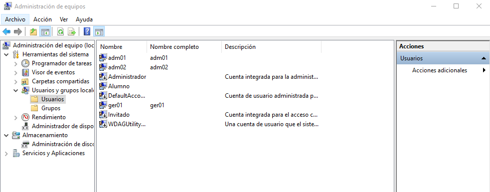
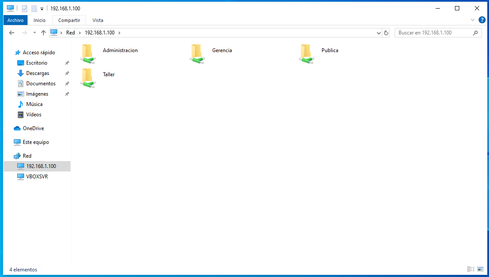
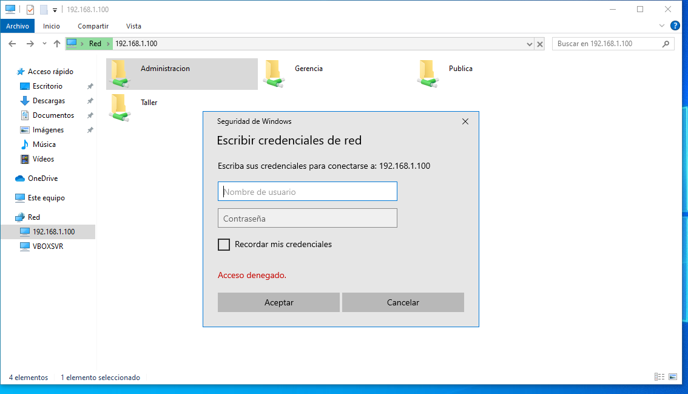
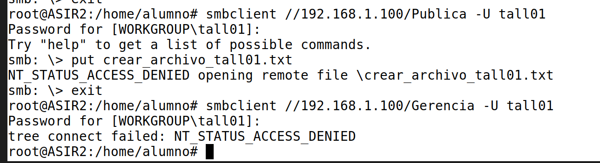
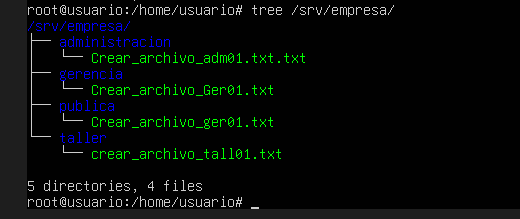

```
---------------- ADMINISTRACIÓN DE SISTEMAS INFORMÁTICOS Y REDES ----------------
---------------------------------------------------------------------------------

Módulo:                     ADMINISTRACIÓN DE SISTEMAS OPERATIVOS
Profesor:                   Víctor J. González
Unidad de Trabajo:          UT07
Práctica:                   PR0701. Compartición de carpetas con Samba
Resultados de aprendizaje:  RA6
```

# PR0701:  Compartición de carpetas con Samba

En esta práctica vamos a trabajar con carpetas compartidas en Linux mediante Samba preparando una infraestructura de red para una empresa:

Vamos a suponer que queremos compartir 4 carpetas:

- Gerencia
- Administración
- Taller
- Pública

Por otro lado, la empresa tendrá 6 empleados: `ger01`, `adm01`, `adm02`, `tall01`, `tall02` y `tall03`.

Estas carpetas serán accesibles por los siguientes usuarios según los siguientes criterios:

- Todos los empleados podrán acceder a la carpeta `Pública` con permisos de lectura, mientras que el empleado `ger01` podrá hacerlo con permisos de lectura y escritura.
-El empleado `ger01` podrá acceder con todos los permisos a la carpeta `Gerencia`.
-Los empleados `adm01` y `adm02` tendrán acceso con todos los permisos a `Administración` y con permisos de lectura únicamente a la carpeta `Taller`.
- Por último, los usuarios `tall01`, `tall02` y `tall03` tendrán acceso de lectura y escritura a la carpeta `Taller`.
- Finalmente, cualquier usuario que no sea uno de los anteriores (invitado) podrá acceder únicamente a la carpeta `Pública`.

Algunas cuestiones que tienes que tener en cuenta:

- Utiliza grupos para agrupar usuarios.
- Crea una carpeta común dentro de la cual estarán todas las carpetas compartidas.
- Recuerda que el propietario de las carpetas compartidas es `root` y el grupo propietario aquel que vaya a tener permisos.
- Para asignar diferentes tipos de permisos a diferentes usuarios en la misma carpeta debes usar los parámetros `read list` y `write list` del fichero smb.conf. 

Los usuarios `ger01`, `adm01` y `adm02` utilizarán máquinas Windows, por lo que créalos en un Windows de escritorio que tengas y verifica que funcionan.

El resto de los usuarios usan Linux, por lo que debes crearlos en otra máquina Linux y prueba el acceso desde ella.

Para la entrega de la práctica debes documentar todos los pasos realizados.

---

Necesitamos 3 máquinas virtuales:
  * Ubuntu Server
  * Windows Cliente
  * Linux Cliente

Las tres maquina tienen que tener un adaptador `puente`.

Configuras las IP estaticas en cada maquina.

Una vez realizaddo eso empezamos con la instalación.

##### EN UBUNTU SERVER:

Instalamos Samba

```bash
apt install samba
```

Ya instalado, creamos la estructura de carpetas:

```bash
mkdir /srv/empresa
mkdir /srv/empresa/publica
mkdir /srv/empresa/gerencia
mkdir /srv/empresa/administracion
mkdir /srv/empresa/taller
```

A continuación, creamos los grupos:

```bash
groupadd empleados
groupadd gerencia
groupadd administracion
groupadd taller
```

Y creamos tambien los usuarios:

```bash
useradd -m -G gerencia,empleados ger01
useradd -m -G administracion,empleados adm01
useradd -m -G administracion,empleados adm02
useradd -m -G taller,empleados tall01
useradd -m -G taller,empleados tall02
useradd -m -G taller,empleados tall03
```

Y les asignamos contraseña:

```bash
passwd ger01
passwd adm01
passwd adm02
passwd tall01
passwd tall02
passwd tall03
```

Luego, hay que crear los usuario para samba:

```bash
smbpasswd -a ger01
smbpasswd -a adm01
smbpasswd -a adm02
smbpasswd -a tall01
smbpasswd -a tall02
smbpasswd -a tall03
```

Y activarlos:

```bash
smbpasswd -e ger01
smbpasswd -e adm01
smbpasswd -e adm02
smbpasswd -e tall01
smbpasswd -e tall02
smbpasswd -e tall03
```

Ahora, asignamos permisos y grupos a las carpetas creadas anteriormente:

```bash
chown root:empleados /srv/empresa/publica
chown root:gerencia /srv/empresa/gerencia
chown root:administracion /srv/empresa/administracion
chown root:taller /srv/empresa/taller
chmod 775 /srv/empresa/publica
chmod 770 /srv/empresa/gerencia
chmod 770 /srv/empresa/administracion
chmod 770 /srv/empresa/taller
```

Después, editas el archivo `/etc/samba/smb.cnf` y añades al final:

```ini
[Publica]
   path = /srv/empresa/publica
   browseable = yes
   guest ok = yes
   writable = no
   read list = @empleados
   write list = ger01

[Gerencia]
   path = /srv/empresa/gerencia
   browseable = yes
   valid users = ger01
   writable = yes

[Administracion]
   path = /srv/empresa/administracion
   browseable = yes
   valid users = @administracion
   writable = yes

[Taller]
   path = /srv/empresa/taller
   browseable = yes
   valid users = @administracion,@taller
   read list = @administracion
   write list = @taller
```

Comprubeas que esta bien escrito con:

```bash
testparm
```

Y reinicias el servicio:

```bash
systemctl restart smbd
```

##### EN WINDOWS CLIENTE:

Creamos los usuarios:
* ger01
* adm01
* adm02



Luego, desde el explorador de archivo pones en la ruta la ip del servidor asi `\\192.168.1.100\` y te salen las carpetas:



Desde `ger01` puedes acceder a publica y gerencia, pero si intentas acceder al resto no te deja:



Y desde un usuario de administracion solo te dejara hacer lo configurado tambien.

##### EN UBUNTU CLIENTE

Creas los usuario de taller:

```bash
useradd -m tall01
useradd -m tall02
useradd -m tall03
passwd tall01
passwd tall02
passwd tall03
```

E instalas samba cliente:

```bash
apt install smbclient
```

Y accedes:

```bash
smbclient //192.168.1.100/Taller -U tall01
```

Introduces la contraseña y estas dentro de la carpeta Taller donde puedes crear archivos desde los usuarios de este grupo:

Primero lo creas fuera de samba con un `touch` y dentro de samba pones:

```
put "nombre del archivo"
```

Si intentas entrar a otra carpeta o si intentas escribir en `Publica` te da error:



Al final debe ser algo asi:



---

[VOLVER A INICIO](../../../index.md)